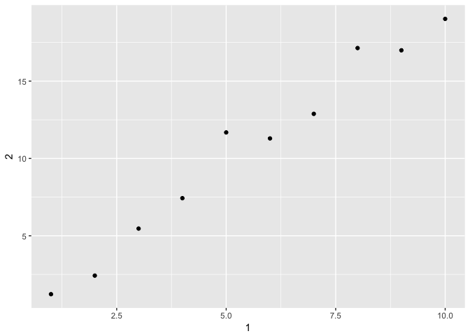

```r
library(tidyverse)
```

## 10.5 Exercises

1. How can you tell if an object is a tibble? (Hint: try printing `mtcars`, which is a regular data frame).

Printing a dataframe like `mtcars` to the console prints the entire dataframe, whereas printing a tibble gives only the first 10 rows with the classes of each column on top.


```r
class(mtcars)
```

```
## [1] "data.frame"
```

```r
class(as_tibble(mtcars))
```

```
## [1] "tbl_df"     "tbl"        "data.frame"
```

2. Compare and contrast the following operations on a data.frame and equivalent tibble. What is different? Why might the default data frame behaviours cause you frustration?

We can test for differences by turning `df` into a tibble and running the same operations.


```r
df <- data.frame(abc = 1, xyz = "a")
df$x
df[, "xyz"]
df[, c("abc", "xyz")]

tbl <- as_tibble(df)
tbl$x
tbl[, "xyz"]
tbl[, c("abc", "xyz")]
```

Dataframes partially match column names so `df$x` returns the `xyz` column as a vector, whereas `tbl$x` will throw an error for an unknown column. Because it only selects one column, `df[, "xyz"]` returns a vector whereas `tbl[, "xyz"]` returns a tibble. I believe `df[, c("abc", "xyz")]` and `tbl[, c("abc", "xyz")]` are equivalent with the exception of course that the first remains a dataframe while the latter is a tibble.

3. If you have the name of a variable stored in an object, e.g. `var <- "mpg"`, how can you extract the reference variable from a tibble?

You can use double bracket `[[` but not `$`. This same behavior seems to apply for both dataframes and tibbles. Note that `tbl[[var]]` returns a vector and not a tibble.


```r
var <- "mpg"

mtcars[[var]] # returns a vector
```

```
##  [1] 21.0 21.0 22.8 21.4 18.7 18.1 14.3 24.4 22.8 19.2 17.8 16.4 17.3 15.2
## [15] 10.4 10.4 14.7 32.4 30.4 33.9 21.5 15.5 15.2 13.3 19.2 27.3 26.0 30.4
## [29] 15.8 19.7 15.0 21.4
```

```r
mtcars$var # NULL
```

```
## NULL
```

```r
tbl <- as_tibble(mtcars)
tbl[[var]] # returns a vector
```

```
##  [1] 21.0 21.0 22.8 21.4 18.7 18.1 14.3 24.4 22.8 19.2 17.8 16.4 17.3 15.2
## [15] 10.4 10.4 14.7 32.4 30.4 33.9 21.5 15.5 15.2 13.3 19.2 27.3 26.0 30.4
## [29] 15.8 19.7 15.0 21.4
```

```r
tbl$var # unknown column
```

```
## Warning: Unknown or uninitialised column: 'var'.
```

```
## NULL
```


4. Practice referring to non-syntactic names in the following data frame by:


```r
annoying <- tibble(
  `1` = 1:10,
  `2` = `1` * 2 + rnorm(length(`1`))
)
```

* Extracting the variable called 1.


```r
annoying$`1` # returns a vector
```

```
##  [1]  1  2  3  4  5  6  7  8  9 10
```

* Plotting a scatterplot of 1 vs 2.


```r
ggplot(annoying, aes(x = `1`, y = `2`)) + geom_point()
```

<!-- -->


* Creating a new column called 3 which is 2 divided by 1.


```r
annoying %>% mutate(`3` = `2` / `1`)
```

```
## # A tibble: 10 x 3
##      `1`   `2`   `3`
##    <int> <dbl> <dbl>
##  1     1  1.22  1.22
##  2     2  2.43  1.21
##  3     3  5.47  1.82
##  4     4  7.43  1.86
##  5     5 11.7   2.34
##  6     6 11.3   1.88
##  7     7 12.9   1.84
##  8     8 17.1   2.14
##  9     9 17.0   1.89
## 10    10 19.0   1.90
```

* Renaming the columns to one, two and three.


```r
annoying %>% 
    mutate(`3` = `2` / `1`) %>%
    rename(one = `1`, two = `2`, three = `3`)
```

```
## # A tibble: 10 x 3
##      one   two three
##    <int> <dbl> <dbl>
##  1     1  1.22  1.22
##  2     2  2.43  1.21
##  3     3  5.47  1.82
##  4     4  7.43  1.86
##  5     5 11.7   2.34
##  6     6 11.3   1.88
##  7     7 12.9   1.84
##  8     8 17.1   2.14
##  9     9 17.0   1.89
## 10    10 19.0   1.90
```

5. What does `tibble::enframe()` do? When might you use it?

`enframe()` converts named atomic vectors or lists to two-column data frames. For unnamed vectors, the natural sequence is used as name column.


```r
enframe(c(a = 5, b = 7))
```

```
## # A tibble: 2 x 2
##   name  value
##   <chr> <dbl>
## 1 a        5.
## 2 b        7.
```

6. What option controls how many additional column names are printed at the footer of a tibble?

`n_extra` controls the number of additional column names printed at the footer of a tibble.


```r
print(nycflights13::flights) # by default gives all extra column names in footer
print(nycflights13::flights, n_extra = 2) # will give 2 additional column names in footer
```

