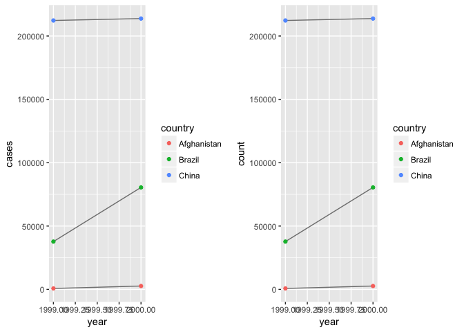
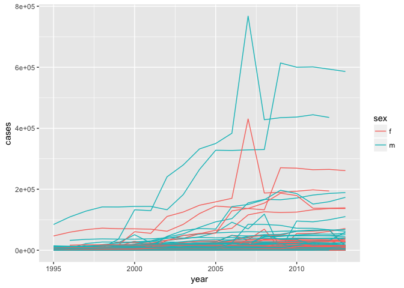

```r
library(tidyverse)
library(gridExtra)
```

## 12.2.1 Exercises

1. Using prose, describe how the variables and observations are organised in each of the sample tables.

`table1` is tidy because each variable a column, each observation a row, each value its own cell.

```r
table1
```

```
## # A tibble: 6 x 4
##   country      year  cases population
##   <chr>       <int>  <int>      <int>
## 1 Afghanistan  1999    745   19987071
## 2 Afghanistan  2000   2666   20595360
## 3 Brazil       1999  37737  172006362
## 4 Brazil       2000  80488  174504898
## 5 China        1999 212258 1272915272
## 6 China        2000 213766 1280428583
```

`table2` stores variables `cases` and `population` as values of a `type` variable and creates a new variable `count` for their respective values.


```r
table2
```

```
## # A tibble: 12 x 4
##    country      year type            count
##    <chr>       <int> <chr>           <int>
##  1 Afghanistan  1999 cases             745
##  2 Afghanistan  1999 population   19987071
##  3 Afghanistan  2000 cases            2666
##  4 Afghanistan  2000 population   20595360
##  5 Brazil       1999 cases           37737
##  6 Brazil       1999 population  172006362
##  7 Brazil       2000 cases           80488
##  8 Brazil       2000 population  174504898
##  9 China        1999 cases          212258
## 10 China        1999 population 1272915272
## 11 China        2000 cases          213766
## 12 China        2000 population 1280428583
```

`table3` stores the variables `cases` and `population` as one column separated with a "/" called `rate`.


```r
table3
```

```
## # A tibble: 6 x 3
##   country      year rate             
## * <chr>       <int> <chr>            
## 1 Afghanistan  1999 745/19987071     
## 2 Afghanistan  2000 2666/20595360    
## 3 Brazil       1999 37737/172006362  
## 4 Brazil       2000 80488/174504898  
## 5 China        1999 212258/1272915272
## 6 China        2000 213766/1280428583
```

`table4` stores the values of the `year` variable as columns filled with `cases` values in `table 4a` and `population` values in `table4b`.


```r
table4a
```

```
## # A tibble: 3 x 3
##   country     `1999` `2000`
## * <chr>        <int>  <int>
## 1 Afghanistan    745   2666
## 2 Brazil       37737  80488
## 3 China       212258 213766
```

```r
table4b
```

```
## # A tibble: 3 x 3
##   country         `1999`     `2000`
## * <chr>            <int>      <int>
## 1 Afghanistan   19987071   20595360
## 2 Brazil       172006362  174504898
## 3 China       1272915272 1280428583
```


2. Compute the `rate` for `table2`, and `table4a + table4b`. You will need to perform four operations:

* Extract the number of TB cases per country per year.

* Extract the matching population per country per year.

* Divide cases by population, and multiply by 10000.

* Store back in the appropriate place.


```r
cases <- table2 %>% filter(type == "cases") %>% .$count
population <- table2 %>% filter(type == "population") %>% .$count
year <- table2 %>% filter(type == "cases") %>% .$year
country <- table2 %>% filter(type == "cases") %>% .$country

tab2_tidy <- tibble(country, year, rate = cases / population * 10000)
tab2_tidy
```

```
## # A tibble: 6 x 3
##   country      year  rate
##   <chr>       <int> <dbl>
## 1 Afghanistan  1999 0.373
## 2 Afghanistan  2000 1.29 
## 3 Brazil       1999 2.19 
## 4 Brazil       2000 4.61 
## 5 China        1999 1.67 
## 6 China        2000 1.67
```


```r
country_b <- rep(table4a %>% .$country, each = 2)
year_b <- rep(names(table4b)[-1], 3)
cases_b <- c(rbind(table4a %>% .$`1999`, table4a %>% .$`2000`))
pop_b <- c(rbind(table4b %>% .$`1999`, table4b %>% .$`2000`))

tab4_tidy <- tibble(country_b, year_b, rate = cases_b / pop_b * 10000)
tab4_tidy
```

```
## # A tibble: 6 x 3
##   country_b   year_b  rate
##   <chr>       <chr>  <dbl>
## 1 Afghanistan 1999   0.373
## 2 Afghanistan 2000   1.29 
## 3 Brazil      1999   2.19 
## 4 Brazil      2000   4.61 
## 5 China       1999   1.67 
## 6 China       2000   1.67
```

Which representation is easiest to work with? Which is hardest? Why?

Both can be done but perhaps 4a and 4b are more difficult to work with because values for a single variable are split into different columns. There are better ways to do this however as this chapter will show.

3. Recreate the plot showing change in cases over time using `table2` instead of `table1`. What do you need to do first?

The first step is to filter for `cases`. Then the `count` variable contains the `case` values we want to plot for each country and year.


```r
grid.arrange(
    ggplot(table1, aes(year, cases)) + 
        geom_line(aes(group = country), colour = "grey50") + 
        geom_point(aes(colour = country)),
    table2 %>% 
        filter(type == "cases") %>%
        ggplot(aes(year, count)) + 
            geom_line(aes(group = country), colour = "grey50") + 
            geom_point(aes(colour = country)),
    ncol = 2
)
```

<!-- -->

## 12.3.3 Exercises

1. Why are `gather()` and `spread()` not perfectly symmetrical?
Carefully consider the following example:


```r
stocks <- tibble(
  year   = c(2015, 2015, 2016, 2016),
  half  = c(   1,    2,     1,    2),
  return = c(1.88, 0.59, 0.92, 0.17)
)
stocks %>% 
  spread(year, return) %>% 
  gather("year", "return", `2015`:`2016`)
```

```
## # A tibble: 4 x 3
##    half year  return
##   <dbl> <chr>  <dbl>
## 1    1. 2015   1.88 
## 2    2. 2015   0.590
## 3    1. 2016   0.920
## 4    2. 2016   0.170
```

(Hint: look at the variable types and think about column names.)

The `year` variable is intiially numeric. When the values of `year` are spread into variable names, the numeric years have been coerced to character strings. When those character years are then gathered into values of the variable `year` once more, they retain their character class. Tbe class attribute was lost.

Both `spread()` and `gather()` have a convert argument. What does it do?

The `convert` argument, if set to `TRUE`, can address the type coercion problem in the above example. Note how the year variable retains its numeric class with `convert` set to `TRUE`.


```r
stocks %>% 
  spread(year, return) %>% 
  gather("year", "return", `2015`:`2016`, convert = TRUE)
```

```
## # A tibble: 4 x 3
##    half  year return
##   <dbl> <int>  <dbl>
## 1    1.  2015  1.88 
## 2    2.  2015  0.590
## 3    1.  2016  0.920
## 4    2.  2016  0.170
```

2. Why does this code fail?


```r
table4a %>% 
  gather(1999, 2000, key = "year", value = "cases")
```

It fails because `1999` and `2000` are non-syntactic. Putting them in backticks makes the code run as intended.


```r
table4a %>% 
  gather(`1999`, `2000`, key = "year", value = "cases")
```

```
## # A tibble: 6 x 3
##   country     year   cases
##   <chr>       <chr>  <int>
## 1 Afghanistan 1999     745
## 2 Brazil      1999   37737
## 3 China       1999  212258
## 4 Afghanistan 2000    2666
## 5 Brazil      2000   80488
## 6 China       2000  213766
```


3. Why does spreading this tibble fail? How could you add a new column to fix the problem?


```r
people <- tribble(
  ~name,             ~key,    ~value,
  #-----------------|--------|------
  "Phillip Woods",   "age",       45,
  "Phillip Woods",   "height",   186,
  "Phillip Woods",   "age",       50,
  "Jessica Cordero", "age",       37,
  "Jessica Cordero", "height",   156
)
people
```

```
## # A tibble: 5 x 3
##   name            key    value
##   <chr>           <chr>  <dbl>
## 1 Phillip Woods   age      45.
## 2 Phillip Woods   height  186.
## 3 Phillip Woods   age      50.
## 4 Jessica Cordero age      37.
## 5 Jessica Cordero height  156.
```

Spreading fails because there are two values for a single variable (`age`) of one observation (Phillip Woods). If we added a variable representing the appearance count of an age value, then we could spread it.


```r
people %>%
    mutate(obs = c(1,1,2,1,1)) %>%
    spread(key, value)
```

```
## # A tibble: 3 x 4
##   name              obs   age height
##   <chr>           <dbl> <dbl>  <dbl>
## 1 Jessica Cordero    1.   37.   156.
## 2 Phillip Woods      1.   45.   186.
## 3 Phillip Woods      2.   50.    NA
```

4. Tidy the simple tibble below. Do you need to spread or gather it? What are the variables?

You need to gather it because `male` and `female` are values of the key `gender`. The variables are the logical `pregnant` the categorical `sex` and the numeric `obs`.

```r
preg <- tribble(
  ~pregnant, ~male, ~female,
  "yes",     NA,    10,
  "no",      20,    12
)
preg %>%
    gather(key = sex, value = obs, male, female)
```

```
## # A tibble: 4 x 3
##   pregnant sex      obs
##   <chr>    <chr>  <dbl>
## 1 yes      male     NA 
## 2 no       male     20.
## 3 yes      female   10.
## 4 no       female   12.
```

## 12.4.3 Exercises

1. What do the `extra` and `fill` arguments do in `separate()`? Experiment with the various options for the following two toy datasets.


```r
tibble(x = c("a,b,c", "d,e,f,g", "h,i,j")) %>% 
  separate(x, c("one", "two", "three"), extra = "merge")
```

```
## # A tibble: 3 x 3
##   one   two   three
##   <chr> <chr> <chr>
## 1 a     b     c    
## 2 d     e     f,g  
## 3 h     i     j
```

In the first example, we get a warning that a piece has been discarded. The second row had four observations despite there being only three columns. We get the warning because the argument `extra` is set to "warn" by default. Changing it to "drop" would remove the warning and produce the same result. Setting it to "merge" keep the extra value in the same cell as last column in that row.


```r
tibble(x = c("a,b,c", "d,e", "f,g,i")) %>% 
  separate(x, c("one", "two", "three"))
```

```
## Warning: Expected 3 pieces. Missing pieces filled with `NA` in 1 rows [2].
```

```
## # A tibble: 3 x 3
##   one   two   three
##   <chr> <chr> <chr>
## 1 a     b     c    
## 2 d     e     <NA> 
## 3 f     g     i
```

In the second example we get a warning that a missing piece has been filled with `NA`. This is because the `fill` argument is set to "warn" by default. Changing it to "left" or "right" removes the warning and specifies where to place the missing value.

2. Both `unite()` and `separate()` have a `remove` argument. What does it do? Why would you set it to FALSE?

The `remove` argument, if set to `FALSE`, will retain the input column in the output dataframe. It's useful if you wanted to compare before and after the union or separation. For example:


```r
tibble(x = c("a,b,c", "d,e", "f,g,i")) %>% 
  separate(x, c("one", "two", "three"), fill = "right", remove = FALSE)
```

```
## # A tibble: 3 x 4
##   x     one   two   three
##   <chr> <chr> <chr> <chr>
## 1 a,b,c a     b     c    
## 2 d,e   d     e     <NA> 
## 3 f,g,i f     g     i
```

3. Compare and contrast `separate()` and `extract()`. Why are there three variations of separation (by position, by separator, and with groups), but only one unite?

Both `separate()` and `extract()` are meant to split one column into multiple columns. `separate()` does this by a splitting pattern or position. `extract()` needs regular expression groups. Variations of separation are needed because there are many ways to split one entity into many (position, separator, groups), but there's only one way to combine successfully.

## 12.5.1 Exercises

1. Compare and contrast the `fill` arguments to `spread()` and `complete()`.

Both `fill` arguments intend to replace missing values. `spread()`'s primary function is for spreading key-value pairs across multiple columns, but its `fill` argument can replace missing values with a specified value. For example,


```r
table2[[1,4]] <- NA
table2 %>%
    spread(key = type, value = count, fill = "missing")
```

```
## # A tibble: 6 x 4
##   country      year cases   population
##   <chr>       <int> <chr>   <chr>     
## 1 Afghanistan  1999 missing 19987071  
## 2 Afghanistan  2000 2666    20595360  
## 3 Brazil       1999 37737   172006362 
## 4 Brazil       2000 80488   174504898 
## 5 China        1999 212258  1272915272
## 6 China        2000 213766  1280428583
```

`complete()` is intended to turn implicit missing values into explicit missing values. Its `fill` argument takes a named list for each variable letting you specify values instead of NA. So in the example below, it specifies 0 instead of `NA`.


```r
df <- tibble(
  group = c(1:2, 1),
  item_id = c(1:2, 2),
  item_name = c("a", "b", "b"),
  value1 = 1:3,
  value2 = 4:6
)
df %>% complete(group, nesting(item_id, item_name), fill = list(value1 = 0))
```

```
## # A tibble: 4 x 5
##   group item_id item_name value1 value2
##   <dbl>   <dbl> <chr>      <dbl>  <int>
## 1    1.      1. a             1.      4
## 2    1.      2. b             3.      6
## 3    2.      1. a             0.     NA
## 4    2.      2. b             2.      5
```

2. What does the direction argument to `fill()` do?

The direction argument of `fill()` determines the direction in which to fill missing values (the default "down" or "up"). For example:


```r
df <- data.frame(Month = 1:6, Year = c(2000, rep(NA, 5)))
df %>% fill(Year)
```

```
##   Month Year
## 1     1 2000
## 2     2 2000
## 3     3 2000
## 4     4 2000
## 5     5 2000
## 6     6 2000
```

```r
df <- data.frame(Month = 1:6, Year = c(rep(NA, 5), 2000))
df %>% fill(Year, .direction = "up")
```

```
##   Month Year
## 1     1 2000
## 2     2 2000
## 3     3 2000
## 4     4 2000
## 5     5 2000
## 6     6 2000
```

## 12.6.1 Exercises

1. In this case study I set `na.rm = TRUE` just to make it easier to check that we had the correct values. Is this reasonable? Think about how missing values are represented in this dataset. Are there implicit missing values? What’s the difference between an `NA` and zero?

The presence of zeros in the case variable suggests that 0 indicates the true number of cases and `NA` means no data was collected for that observation (or not present). In this case, removing `NA` values would not remove any information-- with the exception of knowing which countries and years the WHO did not collect data (which could be interesting in its own right).

2. What happens if you neglect the `mutate()` step? (`mutate(key = stringr::str_replace(key, "newrel", "new_rel"))`)

Skipping the `mutate()` step would throw off the pattern we need in the next step when we `separate()` on "_".

3. I claimed that `iso2` and `iso3` were redundant with `country`. Confirm this claim.

No rows turn up in the manipulation below.


```r
who %>%
    select(country, iso2, iso3) %>%
    distinct() %>%
    group_by(country) %>%
    filter(n() > 1)
```

```
## # A tibble: 0 x 3
## # Groups:   country [0]
## # ... with 3 variables: country <chr>, iso2 <chr>, iso3 <chr>
```

4. For each country, year, and sex compute the total number of cases of TB. Make an informative visualisation of the data.


```r
# tidied dataset
who_final <- who %>%
  gather(code, value, new_sp_m014:newrel_f65, na.rm = TRUE) %>% 
  mutate(code = stringr::str_replace(code, "newrel", "new_rel")) %>%
  separate(code, c("new", "var", "sexage")) %>% 
  select(-new, -iso2, -iso3) %>% 
  separate(sexage, c("sex", "age"), sep = 1)

who_final %>%
  group_by(country, year, sex) %>%
  filter(year >= 1995) %>% # little data before 1995
  summarise(cases = sum(value)) %>%
  unite(country_sex, country, sex, remove = FALSE) %>%
  ggplot(aes(x = year, y = cases, group = country_sex, colour = sex)) +
    geom_line()
```

<!-- -->
