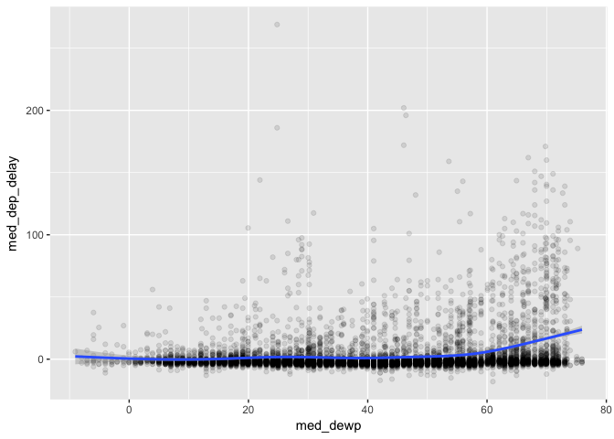
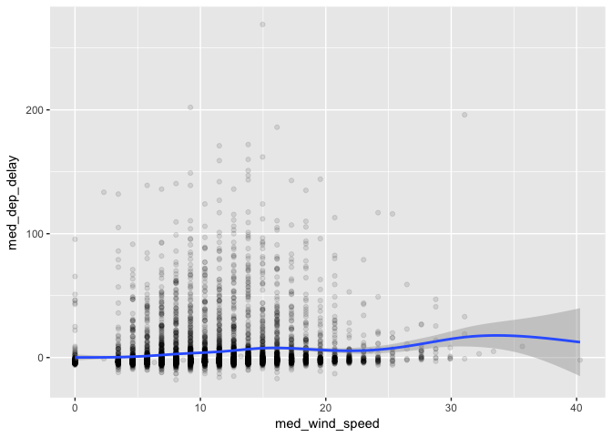
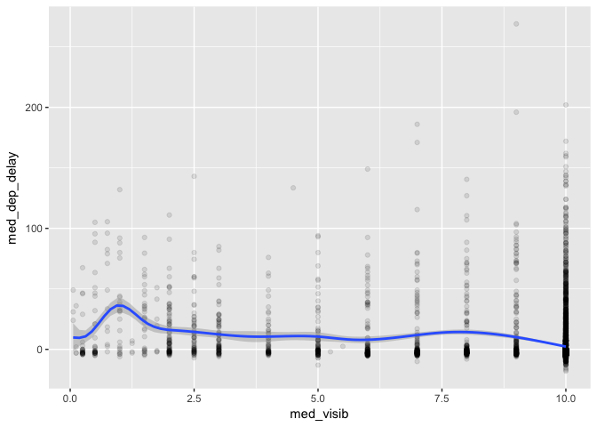
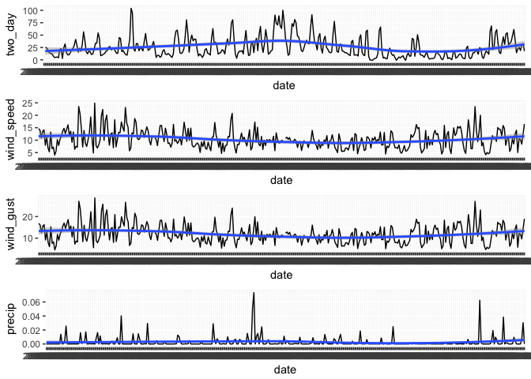

```r
library(tidyverse)
library(nycflights13)
```

## 13.2.1 Exercises

1. Imagine you wanted to draw (approximately) the route each plane flies from its origin to its destination. What variables would you need? What tables would you need to combine?

The `origin` and `dest` variables from `flights` gives airport codes of each flight's origin and destination. We'd match these airport codes with `faa` found in `airports` and use the `lat` and `lon` of each `faa` to be able to know the beginning and end points of each line.

2. I forgot to draw the relationship between `weather` and `airports`. What is the relationship and how should it appear in the diagram?

`airports` connects to `weather` via a single variable, called `faa` in `airports` and `origin` in `weather`.

3. `weather` only contains information for the origin (NYC) airports. If it contained weather records for all airports in the USA, what additional relation would it define with `flights`?

It would also match `dest` from `flights` allowing you to have weather data on both departing and arriving airports.

4. We know that some days of the year are “special”, and fewer people than usual fly on them. How might you represent that data as a data frame? What would be the primary keys of that table? How would it connect to the existing tables?

You could create a dataframe called `special` with variables `name` (with observations like Friday the 13th etc) and `year`, `month`, and `day` that connect it to `flights`. You then might mutate a 0-1 variable to allow filtering of special days.

## 13.3.1 Exercises

1. Add a surrogate key to `flights`.

Counting by `year`, `month`, `day`, `hour`, `minute`, `tailnum` and filtering for `n > 1` returns 298 rows so we have no primary key in the `flights` table. 


```r
flights %>%
    count(year, month, day, hour, minute, tailnum) %>%
    filter(n > 1)
```

```
## # A tibble: 298 x 7
##     year month   day  hour minute tailnum     n
##    <int> <int> <int> <dbl>  <dbl> <chr>   <int>
##  1  2013     1    13   20.     0. N12564      2
##  2  2013     1    16   18.    15. <NA>        3
##  3  2013     1    23   14.     0. <NA>        2
##  4  2013     1    25   18.     0. <NA>        2
##  5  2013     1    28    7.    59. N13969      2
##  6  2013     1    30   16.     0. <NA>        2
##  7  2013     1    30   16.     5. <NA>        2
##  8  2013     1    30   19.     0. <NA>        2
##  9  2013     1    31    7.     0. <NA>        2
## 10  2013     1    31    8.     0. <NA>        2
## # ... with 288 more rows
```

We can arrange first before adding rownames as a surrogate key to give the key some meaning if not an absolute one.


```r
flights %>%
    arrange(year, month, day, hour, minute, tailnum) %>%
    rownames_to_column("id")
```

```
## # A tibble: 336,776 x 20
##    id     year month   day dep_time sched_dep_time dep_delay arr_time
##    <chr> <int> <int> <int>    <int>          <int>     <dbl>    <int>
##  1 1      2013     1     1      517            515        2.      830
##  2 2      2013     1     1      533            529        4.      850
##  3 3      2013     1     1      542            540        2.      923
##  4 4      2013     1     1      544            545       -1.     1004
##  5 5      2013     1     1      554            558       -4.      740
##  6 6      2013     1     1      559            559        0.      702
##  7 7      2013     1     1      558            600       -2.      924
##  8 8      2013     1     1      558            600       -2.      753
##  9 9      2013     1     1      559            600       -1.      941
## 10 10     2013     1     1      555            600       -5.      913
## # ... with 336,766 more rows, and 12 more variables: sched_arr_time <int>,
## #   arr_delay <dbl>, carrier <chr>, flight <int>, tailnum <chr>,
## #   origin <chr>, dest <chr>, air_time <dbl>, distance <dbl>, hour <dbl>,
## #   minute <dbl>, time_hour <dttm>
```


2. Identify the keys in the following datasets

* `Lahman::Batting`

```r
Lahman::Batting %>%
    group_by(playerID, yearID, stint) %>%
    filter(n() > 1) %>%
    nrow
```

```
## [1] 0
```

`playerID`, `yearID` and `stint` are all needed to make the key because the data has statistics on a player for multiple years and/or stints.

* `babynames::babynames`


```r
babynames::babynames %>%
    group_by(year, sex, name) %>%
    filter(n() > 1) %>%
    nrow()
```

```
## [1] 0
```

`year`, `name` and `sex` are all needed for a primary key because males and females can share the same name but with different counts.

* `nasaweather::atmos`


```r
nasaweather::atmos %>%
    group_by(lat, long, year, month) %>%
    filter(n() > 1) %>%
    nrow()
```

```
## [1] 0
```

The dataset contains data at a particular latitude and longitude for a given year and month so the primary key is `lat`, `long`, `year` and `month`.

* `fueleconomy::vehicles`


```r
fueleconomy::vehicles %>%
    count(id) %>%
    filter(n > 1) %>%
    nrow
```

```
## [1] 0
```

An easy one-- it's just `id`.

* `ggplot2::diamonds`

None! No combination of columns produces a distinct number of rows equal to the total number of rows in the dataset.

3. Draw a diagram illustrating the connections between the Batting, Master, and Salaries tables in the Lahman package. Draw another diagram that shows the relationship between Master, Managers, AwardsManagers.

I won't draw a diagram but will identify the primary and foreign keys in each table. Primary keys uniquely identify observations in its own table, while foreign keys uniquely identify observations in another table.

* In `Batting`, the primary key is `playerID`, `yearID`, and `stint`. 

* In `Salaries`, the primary key is `playerID` and `yearID`.

* In `Master`, the primary key is `playerID`.

`playerID` of `Master` is also a foreign key present in `Salaries` and `Batting`. From the perspective of `Batting` or `Salaries`, the foreign key `playerID` holds a many-to-one relationship with `Master` because `playerID` is present multiple times in `Salaries` and `Batting` (each year of his career) but present only once in `Master`.

How would you characterise the relationship between the Batting, Pitching, and Fielding tables?

All three tables have the same primary key: `playerID`, `yearID`, and `stint`.

## 13.4.6 Exercises

1. Compute the average delay by destination, then join on the airports data frame so you can show the spatial distribution of delays. Here’s an easy way to draw a map of the United States:


```r
airports %>%
  semi_join(flights, c("faa" = "dest")) %>%
  ggplot(aes(lon, lat)) +
    borders("state") +
    geom_point() +
    coord_quickmap()
```

<!-- -->

First I'll create a dataframe of mean delays by removing cancelled flights and grouping by destination. 


```r
mean_delays <- flights %>%
    filter(!is.na(arr_delay)) %>%
    group_by(dest) %>%
    summarise(mean_delay = mean(arr_delay))
```

We should note that we have 104 destinations here. In airports though we have 1458 unique `faa` airport codes. Nevertheless, 4 destinations in mean_delays are not found in airports.


```r
dests <- mean_delays %>% distinct(dest) %>% pull()
faas <- airports %>% distinct(faa) %>% pull()
setdiff(dests, faas)
```

```
## [1] "BQN" "PSE" "SJU" "STT"
```

If we use a `left_join` and plot we'll get a message that 4 points have been left out. We can avoid this by using an `inner_join`.


```r
mean_delays %>%
    inner_join(airports, by = c("dest" = "faa")) %>%
    ggplot(aes(lon, lat, color = mean_delay)) +
        borders("state") +
        geom_point() +
        coord_quickmap()
```

<!-- -->

2. Add the location of the origin *and* destination (i.e. the `lat` and `lon`) to `flights`.

We could do this with two `left_join`s, renaming the added variables each time for clarity.


```r
flights %>%
    select(carrier, flight, tailnum, origin, dest) %>%
    left_join(select(airports, faa, lat, lon), by = c("origin" = "faa")) %>%
    rename(lat_origin = lat, lon_origin = lon) %>%
    left_join(select(airports, faa, lat, lon), by = c("dest" = "faa")) %>%
    rename(lat_dest = lat, lon_dest = lon)
```

```
## # A tibble: 336,776 x 9
##    carrier flight tailnum origin dest  lat_origin lon_origin lat_dest
##    <chr>    <int> <chr>   <chr>  <chr>      <dbl>      <dbl>    <dbl>
##  1 UA        1545 N14228  EWR    IAH         40.7      -74.2     30.0
##  2 UA        1714 N24211  LGA    IAH         40.8      -73.9     30.0
##  3 AA        1141 N619AA  JFK    MIA         40.6      -73.8     25.8
##  4 B6         725 N804JB  JFK    BQN         40.6      -73.8     NA  
##  5 DL         461 N668DN  LGA    ATL         40.8      -73.9     33.6
##  6 UA        1696 N39463  EWR    ORD         40.7      -74.2     42.0
##  7 B6         507 N516JB  EWR    FLL         40.7      -74.2     26.1
##  8 EV        5708 N829AS  LGA    IAD         40.8      -73.9     38.9
##  9 B6          79 N593JB  JFK    MCO         40.6      -73.8     28.4
## 10 AA         301 N3ALAA  LGA    ORD         40.8      -73.9     42.0
## # ... with 336,766 more rows, and 1 more variable: lon_dest <dbl>
```

3. Is there a relationship between the age of a plane and its delays?

We have 3322 distinct `tailnum`s in `planes`, but 4044 distinct `tailnum`s in `flights`. So not every `tailnum` in `flights` will have the additional age data we want to create. We can account for this using an `inner_join` instead of a `left_join`. We should also notice that `planes %>% filter(is.na(year)) %>% nrow()` observations in `planes` are missing `year` data so we can remove these observations before joining because they don't have the data we want anyway. 

After mutating the age of each `tailnum`, I calculated the mean `arr_delay` for each plane. Plotting `plane_age` vs. `mean_arr_delay` shows very little relationship between the two. Older planes appear not to have longer average delays. Other factors (e.g. `origin` and `dest`) must be more important.


```r
planes2 <- planes %>% filter(!is.na(year)) 

flights %>%
    filter(!is.na(arr_delay)) %>%
    inner_join(select(planes2, tailnum, year), by = "tailnum") %>%
    mutate(plane_age = year.x - year.y) %>%
    group_by(tailnum, plane_age) %>%
    summarize(mean_arr_delay = mean(arr_delay)) %>%
    ggplot(aes(x = plane_age, y = mean_arr_delay)) +
        geom_jitter(alpha = 0.2) +
        geom_smooth()
```

```
## `geom_smooth()` using method = 'gam'
```

<!-- -->

4. What weather conditions make it more likely to see a delay?

Weather conditions at the origin or destination could play a meaningful role in the likelihood of a delay. However `weather` only has data on the three `origin` airports. So we'll restrict our focus to departure delays. It's important to note that we have flight timings down to the minute, but weather data only by the hour. The primary key of `weather` is `origin`, `time_hour`. To further simplify things though, let's ignore `origin` since the weather at EWR, LGA and JFK will be broadly similar. We have the same `time_hour` column present in `flights` so we want to add the associated weather data to each flight for its given `time_hour`. 

To reduce overplotting, I'll calculate median weather stats and median departure delays to see if that gives a rough idea of trends. I took the median because I expect most weather stats (e.g. `precip`) to be skewed. I already know delays are skewed. It also removes one certain error in wind data.


```r
# calculate median weather stats per time_hour
median_weather <- weather %>% 
    group_by(time_hour) %>%
    summarize(med_temp = median(temp),
              med_dewp = median(dewp),
              med_humid = median(humid),
              med_wind_dir = median(wind_dir),
              med_wind_speed = median(wind_speed),
              med_wind_gust = median(wind_gust),
              med_precip = median(precip),
              med_pressure = median(pressure),
              med_visib = median(visib))

# calculate median dep_delay per time_hour
median_delays <- flights %>%
    filter(!is.na(arr_delay)) %>%
    group_by(time_hour) %>%
    summarize(med_dep_delay = median(dep_delay))

# join together
median_weather_cond <- median_delays %>%
    inner_join(median_weather, by = "time_hour")
head(median_weather_cond)
```

```
## # A tibble: 6 x 11
##   time_hour           med_dep_delay med_temp med_dewp med_humid
##   <dttm>                      <dbl>    <dbl>    <dbl>     <dbl>
## 1 2013-01-01 06:00:00           -2.     39.0     26.1      59.4
## 2 2013-01-01 07:00:00           -2.     39.0     26.1      59.4
## 3 2013-01-01 08:00:00           -2.     39.9     27.0      59.5
## 4 2013-01-01 09:00:00           -2.     39.9     28.0      62.2
## 5 2013-01-01 10:00:00           -2.     39.0     27.0      61.6
## 6 2013-01-01 11:00:00           -1.     37.9     27.0      64.3
## # ... with 6 more variables: med_wind_dir <dbl>, med_wind_speed <dbl>,
## #   med_wind_gust <dbl>, med_precip <dbl>, med_pressure <dbl>,
## #   med_visib <dbl>
```

Now we can try to visualize the outcomes for each type of weather data. While some domain-specific knowledge would be useful to interpret changes in weather data, overall, there's appears to be weaker relationships than we might expect between delays and bad weather.


```r
ggplot(median_weather_cond, aes(x = med_temp, y = med_dep_delay)) + 
    geom_point(alpha = 0.1) +
    geom_smooth()
```

```
## `geom_smooth()` using method = 'gam'
```

```
## Warning: Removed 1 rows containing non-finite values (stat_smooth).
```

```
## Warning: Removed 1 rows containing missing values (geom_point).
```

<!-- -->

```r
ggplot(median_weather_cond, aes(x = med_dewp, y = med_dep_delay)) + 
    geom_point(alpha = 0.1) +
    geom_smooth()
```

```
## `geom_smooth()` using method = 'gam'
```

```
## Warning: Removed 1 rows containing non-finite values (stat_smooth).

## Warning: Removed 1 rows containing missing values (geom_point).
```

<!-- -->

```r
ggplot(median_weather_cond, aes(x = med_humid, y = med_dep_delay)) + 
    geom_point(alpha = 0.1) +
    geom_smooth()
```

```
## `geom_smooth()` using method = 'gam'
```

```
## Warning: Removed 1 rows containing non-finite values (stat_smooth).

## Warning: Removed 1 rows containing missing values (geom_point).
```

<!-- -->

```r
ggplot(median_weather_cond, aes(x = med_wind_dir, y = med_dep_delay)) + 
    geom_point(alpha = 0.1) +
    geom_smooth()
```

```
## `geom_smooth()` using method = 'gam'
```

```
## Warning: Removed 361 rows containing non-finite values (stat_smooth).
```

```
## Warning: Removed 361 rows containing missing values (geom_point).
```

<!-- -->

```r
ggplot(median_weather_cond, aes(x = med_wind_speed, y = med_dep_delay)) + 
    geom_point(alpha = 0.1) +
    geom_smooth()
```

```
## `geom_smooth()` using method = 'gam'
```

```
## Warning: Removed 3 rows containing non-finite values (stat_smooth).
```

```
## Warning: Removed 3 rows containing missing values (geom_point).
```

<!-- -->

```r
ggplot(median_weather_cond, aes(x = med_wind_gust, y = med_dep_delay)) + 
    geom_point(alpha = 0.1) +
    geom_smooth()
```

```
## `geom_smooth()` using method = 'gam'
```

```
## Warning: Removed 3 rows containing non-finite values (stat_smooth).

## Warning: Removed 3 rows containing missing values (geom_point).
```

<!-- -->

```r
ggplot(median_weather_cond, aes(x = med_precip, y = med_dep_delay)) + 
    geom_point(alpha = 0.1) +
    geom_smooth()
```

```
## `geom_smooth()` using method = 'gam'
```

<!-- -->

```r
ggplot(median_weather_cond, aes(x = med_pressure, y = med_dep_delay)) + 
    geom_point(alpha = 0.1) +
    geom_smooth()
```

```
## `geom_smooth()` using method = 'gam'
```

```
## Warning: Removed 1325 rows containing non-finite values (stat_smooth).
```

```
## Warning: Removed 1325 rows containing missing values (geom_point).
```

<!-- -->

```r
ggplot(median_weather_cond, aes(x = med_visib, y = med_dep_delay)) + 
    geom_point(alpha = 0.1) +
    geom_smooth()
```

```
## `geom_smooth()` using method = 'gam'
```

<!-- -->

5. What happened on June 13 2013? Display the spatial pattern of delays, and then use Google to cross-reference with the weather.

To explore the spatial pattern of delays, we can repeat our earlier geographic display of delays but filter by the given day. Compared to the earlier scale, we can see this was a particularly bad day for arrival delays. The southern East Coast looks especially bad. There was a major [derecho series]("https://en.wikipedia.org/wiki/June_12%E2%80%9313,_2013_derecho_series") on that day.


```r
june13 <- flights %>% filter(!is.na(dep_time), month == 6, day == 13)
june13 %>%
    group_by(dest) %>%
    summarize(mean_delay = mean(arr_delay), n = n()) %>%
    filter(n > 3) %>%
    inner_join(airports, by = c("dest" = "faa")) %>%
    ggplot(aes(lon, lat)) +
        borders("state") +
        geom_point(aes(size = n, color = mean_delay)) +
        coord_quickmap()
```

<!-- -->

## 13.5.1 Exercises

1. What does it mean for a flight to have a missing `tailnum`? What do the tail numbers that don’t have a matching record in `planes` have in common? (Hint: one variable explains ~90% of the problems.)

If we `anti_join` `flights` with `planes` by `tailnum` we get 52606 observations in `flights` that do not have a matching `tailnum` present in `planes`.

It's hard to say what is special about these flights without a matching `tailnum`. But it is certainly more common amongst certain carriers than others, in particular `AA` and `MQ`. We can see this is we compare the share of all flights across carriers vs. those without matching `tailnum`s.


```r
library(gridExtra)
grid.arrange(
    flights %>%
        count(carrier, sort = TRUE) %>%
        ggplot(aes(x = carrier, y = n)) + geom_col() +
        ggtitle("All Flights by Carrier"),
    flights %>%
        anti_join(planes, by = "tailnum") %>%
        count(carrier, sort = TRUE) %>%
        ggplot(aes(x = carrier, y = n)) + geom_col() +
        ggtitle("Flights without Matching Tailnum by Carrier"),
    ncol = 2
)
```

<!-- -->

I think more investigation would be needed into the `planes` dataset itself. Why are there so many `tailnum`s present in `flights` not in `planes`? 722 `tailnum`s in `flights` are not found in `planes`.


```r
flights_tails <- flights %>% distinct(tailnum) %>% pull(tailnum)
planes_tails <- planes %>% distinct(tailnum) %>% pull(tailnum)
length(setdiff(flights_tails, planes_tails))
```

```
## [1] 722
```

2. Filter `flights` to only show flights with planes that have flown at least 100 flights.

We could do this in two steps. First, find a vector of `tailnum` that match the desired criteria. Then, filter by representation in that vector.


```r
# find tailnum of flights with at least 100 flights
tail100 <- flights %>% 
    count(tailnum, sort = TRUE) %>% 
    filter(!is.na(tailnum), n >= 100) %>% pull(tailnum)

flights %>%
    filter(tailnum %in% tail100)
```

```
## # A tibble: 228,390 x 19
##     year month   day dep_time sched_dep_time dep_delay arr_time
##    <int> <int> <int>    <int>          <int>     <dbl>    <int>
##  1  2013     1     1      517            515        2.      830
##  2  2013     1     1      533            529        4.      850
##  3  2013     1     1      544            545       -1.     1004
##  4  2013     1     1      554            558       -4.      740
##  5  2013     1     1      555            600       -5.      913
##  6  2013     1     1      557            600       -3.      709
##  7  2013     1     1      557            600       -3.      838
##  8  2013     1     1      558            600       -2.      849
##  9  2013     1     1      558            600       -2.      853
## 10  2013     1     1      558            600       -2.      923
## # ... with 228,380 more rows, and 12 more variables: sched_arr_time <int>,
## #   arr_delay <dbl>, carrier <chr>, flight <int>, tailnum <chr>,
## #   origin <chr>, dest <chr>, air_time <dbl>, distance <dbl>, hour <dbl>,
## #   minute <dbl>, time_hour <dttm>
```

Alternatively we could accomplish this in one step with a `semi_join`.


```r
flights %>%
  semi_join(count(flights, tailnum) %>% filter(!is.na(tailnum), n >= 100), 
            by = "tailnum")
```

```
## # A tibble: 228,390 x 19
##     year month   day dep_time sched_dep_time dep_delay arr_time
##    <int> <int> <int>    <int>          <int>     <dbl>    <int>
##  1  2013     1     1      517            515        2.      830
##  2  2013     1     1      533            529        4.      850
##  3  2013     1     1      544            545       -1.     1004
##  4  2013     1     1      554            558       -4.      740
##  5  2013     1     1      555            600       -5.      913
##  6  2013     1     1      557            600       -3.      709
##  7  2013     1     1      557            600       -3.      838
##  8  2013     1     1      558            600       -2.      849
##  9  2013     1     1      558            600       -2.      853
## 10  2013     1     1      558            600       -2.      923
## # ... with 228,380 more rows, and 12 more variables: sched_arr_time <int>,
## #   arr_delay <dbl>, carrier <chr>, flight <int>, tailnum <chr>,
## #   origin <chr>, dest <chr>, air_time <dbl>, distance <dbl>, hour <dbl>,
## #   minute <dbl>, time_hour <dttm>
```

3. Combine `fueleconomy::vehicles` and `fueleconomy::common` to find only the records for the most common models.

We only need to `semi_join` by the primary key of `fueleconomy::common`, which is `make`,`model`.


```r
fueleconomy::vehicles %>%
  semi_join(fueleconomy::common, by = c("make", "model"))
```

```
## # A tibble: 14,531 x 12
##       id make  model  year class trans drive   cyl displ fuel    hwy   cty
##    <int> <chr> <chr> <int> <chr> <chr> <chr> <int> <dbl> <chr> <int> <int>
##  1  1833 Acura Inte…  1986 Subc… Auto… Fron…     4  1.60 Regu…    28    22
##  2  1834 Acura Inte…  1986 Subc… Manu… Fron…     4  1.60 Regu…    28    23
##  3  3037 Acura Inte…  1987 Subc… Auto… Fron…     4  1.60 Regu…    28    22
##  4  3038 Acura Inte…  1987 Subc… Manu… Fron…     4  1.60 Regu…    28    23
##  5  4183 Acura Inte…  1988 Subc… Auto… Fron…     4  1.60 Regu…    27    22
##  6  4184 Acura Inte…  1988 Subc… Manu… Fron…     4  1.60 Regu…    28    23
##  7  5303 Acura Inte…  1989 Subc… Auto… Fron…     4  1.60 Regu…    27    22
##  8  5304 Acura Inte…  1989 Subc… Manu… Fron…     4  1.60 Regu…    28    23
##  9  6442 Acura Inte…  1990 Subc… Auto… Fron…     4  1.80 Regu…    24    20
## 10  6443 Acura Inte…  1990 Subc… Manu… Fron…     4  1.80 Regu…    26    21
## # ... with 14,521 more rows
```

4. Find the 48 hours (over the course of the whole year) that have the worst delays. Cross-reference it with the `weather` data. Can you see any patterns?

I calculated the mean delay for each 2 day period. A better strategy would be to group by hour instead of day since 48 hours doesn't have to coincide perfectly with days. Nevertheless after doing that, I applied the same strategy to weather. Then I plotted both trends against date. I'm sure there are better approaches for visualizing the relationship, but I'm not clear on that yet.


```r
delay_periods <- flights %>%
    filter(!is.na(arr_delay)) %>%
    separate(time_hour, c("date", "time"), sep = " ") %>%
    group_by(date) %>%
    summarize(one_day = mean(dep_delay)) %>%
    mutate(two_day = one_day + lag(one_day)) %>% 
    arrange(desc(two_day)) %>%
    select(-one_day)

weather_periods <- weather %>%
    separate(time_hour, c("date", "time"), sep = " ") %>%
    group_by(date) %>%
    summarize(wind_speed = mean(wind_speed), 
              wind_gust = mean(wind_gust), 
              precip = mean(precip))

periods <- delay_periods %>% left_join(weather_periods)
```

```
## Joining, by = "date"
```

```r
grid.arrange(
    ggplot(periods, aes(x = date, y = two_day, group = 1)) + 
        geom_line() + geom_smooth(),
    ggplot(periods, aes(x = date, y = wind_speed, group = 1)) + 
        geom_line() + geom_smooth(),
    ggplot(periods, aes(x = date, y = wind_gust, group = 1)) + 
        geom_line() + geom_smooth(),
    ggplot(periods, aes(x = date, y = precip, group = 1)) + 
        geom_line() + geom_smooth(),
    ncol = 1
)
```

```
## `geom_smooth()` using method = 'loess'
```

```
## Warning: Removed 1 rows containing non-finite values (stat_smooth).
```

```
## Warning: Removed 1 rows containing missing values (geom_path).
```

```
## `geom_smooth()` using method = 'loess'
```

```
## Warning: Removed 3 rows containing non-finite values (stat_smooth).
```

```
## `geom_smooth()` using method = 'loess'
```

```
## Warning: Removed 3 rows containing non-finite values (stat_smooth).
```

```
## `geom_smooth()` using method = 'loess'
```

<!-- -->

5. What does `anti_join(flights, airports, by = c("dest" = "faa"))` tell you? What does `anti_join(airports, flights, by = c("faa" = "dest"))` tell you?

* The first returns rows in `flights` that have `dest` not present in the `faa` column of `airports`.

* The second returns rows in `airports` that have `faa` not present in the `dest` column of `flights`.

6. You might expect that there’s an implicit relationship between plane and airline, because each plane is flown by a single airline. Confirm or reject this hypothesis using the tools you’ve learned above.

While in most cases this would be largely true, the problem with this hypothesis is that some planes (`tailnum`) do change carriers. Either they are sold or maybe an airline folds or merges into a new airline. There's probably a more elegant way to do this a mutating join but my strategy was to find `tailnum`s that belong to more than one carrier. With that vector, I then filtered the `flights` dataset to count the number of flights per carrier for each of these `tailnum`s.


```r
multiple_carriers <- flights %>%
    group_by(tailnum, carrier) %>%
    count() %>%
    group_by(tailnum) %>%
    summarize(n = n()) %>%
    filter(n > 1) %>%
    pull(tailnum)

flights %>%
    filter(tailnum %in% multiple_carriers) %>%
    group_by(tailnum, carrier) %>%
    summarize(n = n())
```

```
## # A tibble: 41 x 3
## # Groups:   tailnum [?]
##    tailnum carrier     n
##    <chr>   <chr>   <int>
##  1 N146PQ  9E          8
##  2 N146PQ  EV         36
##  3 N153PQ  9E          5
##  4 N153PQ  EV         26
##  5 N176PQ  9E          7
##  6 N176PQ  EV         21
##  7 N181PQ  9E          4
##  8 N181PQ  EV         35
##  9 N197PQ  9E          2
## 10 N197PQ  EV         31
## # ... with 31 more rows
```
