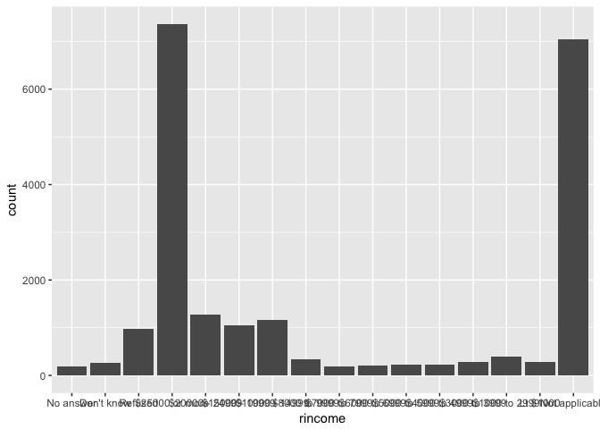
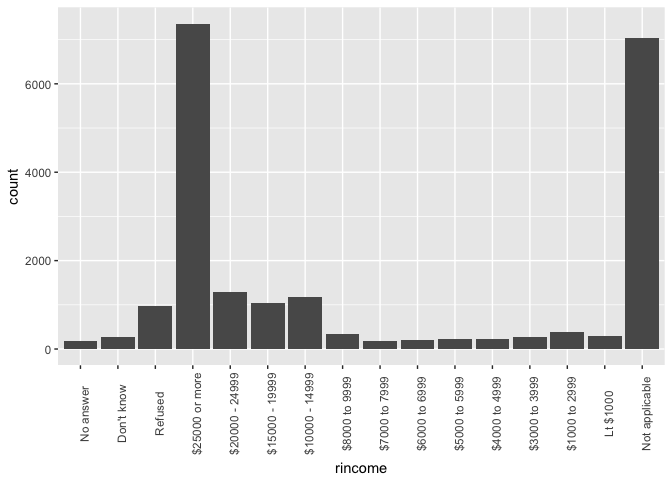
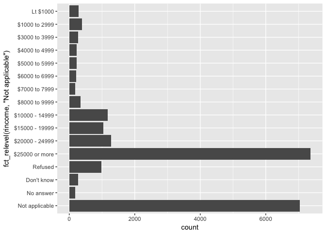
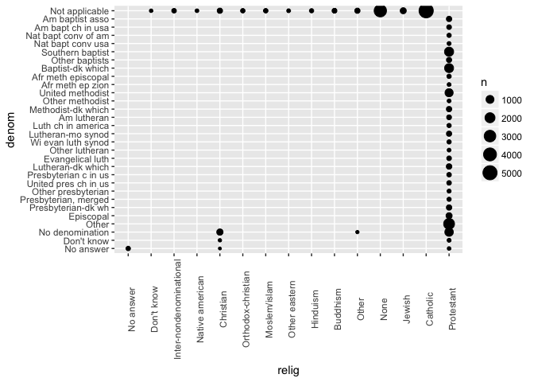
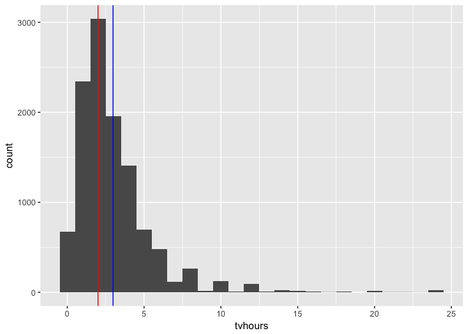
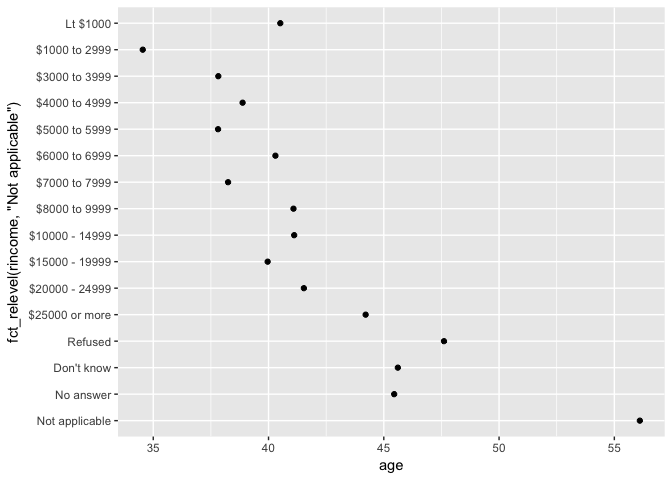
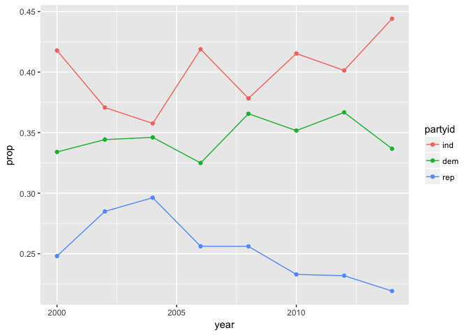

```r
library(tidyverse)
library(forcats)
```

## 15.3.1 Exercise

1. Explore the distribution of `rincome` (reported income). What makes the default bar chart hard to understand? How could you improve the plot?

On the default bar chart, the overlapping x-axis labels are difficult to read.


```r
ggplot(gss_cat, aes(x = rincome)) + 
    geom_bar()
```

<!-- -->

One option is to change the x-axis labels to a vertical orientation.


```r
ggplot(gss_cat, aes(x = rincome)) + 
    geom_bar() + 
    theme(axis.text.x = element_text(angle = 90))
```

<!-- -->

If you don't want to turn your head to read the labels though, you might prefer switching the coordinates of the entire plot.


```r
ggplot(gss_cat, aes(x = fct_relevel(rincome, "Not applicable"))) + 
    geom_bar() + 
    coord_flip()
```

<!-- -->

2. What is the most common relig in this survey? What’s the most common partyid?

The most common `relig` is Protestant and the most common `partyid` is Independent.


```r
gss_cat %>% count(relig, sort = TRUE)
```

```
## # A tibble: 15 x 2
##    relig                       n
##    <fct>                   <int>
##  1 Protestant              10846
##  2 Catholic                 5124
##  3 None                     3523
##  4 Christian                 689
##  5 Jewish                    388
##  6 Other                     224
##  7 Buddhism                  147
##  8 Inter-nondenominational   109
##  9 Moslem/islam              104
## 10 Orthodox-christian         95
## 11 No answer                  93
## 12 Hinduism                   71
## 13 Other eastern              32
## 14 Native american            23
## 15 Don't know                 15
```

```r
gss_cat %>% count(partyid, sort = TRUE)
```

```
## # A tibble: 10 x 2
##    partyid                n
##    <fct>              <int>
##  1 Independent         4119
##  2 Not str democrat    3690
##  3 Strong democrat     3490
##  4 Not str republican  3032
##  5 Ind,near dem        2499
##  6 Strong republican   2314
##  7 Ind,near rep        1791
##  8 Other party          393
##  9 No answer            154
## 10 Don't know             1
```

3. Which relig does denom (denomination) apply to? How can you find out with a table? How can you find out with a visualisation?

If we count by `relig` and `denom`, we can see the number of responses for each combination. Many religions, such as Catholic, have only one `denom` entry: "Not applicable". And that total matches their total in the above table. Protestant is the `relig` where `denom` applies for the vast majority. But it also looks like those responding "Christian" may have been given the chance to answer.


```r
gss_cat %>% count(relig, denom)
```

```
## # A tibble: 47 x 3
##    relig                   denom               n
##    <fct>                   <fct>           <int>
##  1 No answer               No answer          93
##  2 Don't know              Not applicable     15
##  3 Inter-nondenominational Not applicable    109
##  4 Native american         Not applicable     23
##  5 Christian               No answer           2
##  6 Christian               Don't know         11
##  7 Christian               No denomination   452
##  8 Christian               Not applicable    224
##  9 Orthodox-christian      Not applicable     95
## 10 Moslem/islam            Not applicable    104
## # ... with 37 more rows
```

If we plot this table in a scatterplot, mapping size to frequency we can see how Protestant occupies almost all of these responses.


```r
gss_cat %>%
  count(relig, denom) %>%
  ggplot(aes(x = relig, y = denom, size = n)) +
        geom_point() +
        theme(axis.text.x = element_text(angle = 90))
```

<!-- -->


## 15.4.1 Exercises

1. There are some suspiciously high numbers in `tvhours`. Is the mean a good summary?

Quite a few values are actually 24 so suspicious indeed.


```r
tail(sort(gss_cat$tvhours), 25)
```

```
##  [1] 22 22 23 24 24 24 24 24 24 24 24 24 24 24 24 24 24 24 24 24 24 24 24
## [24] 24 24
```

We can see these suspiciously high numbers in a histogram. The right skew pulls the blue mean line to the right of the median in red. This makes the mean a poor summary.


```r
ggplot(gss_cat, aes(x = tvhours)) + 
    geom_histogram(binwidth = 1) + 
    geom_vline(xintercept = median(gss_cat$tvhours, na.rm = TRUE), color = "red") +
    geom_vline(xintercept = mean(gss_cat$tvhours, na.rm = TRUE), color = "blue")
```

```
## Warning: Removed 10146 rows containing non-finite values (stat_bin).
```

<!-- -->

2. For each factor in `gss_cat` identify whether the order of the levels is arbitrary or principled.

We can quickly find the factor variables in the dataset with the `keep` function.


```r
keep(gss_cat, is.factor) %>% names()
```

```
## [1] "marital" "race"    "rincome" "partyid" "relig"   "denom"
```

* `marital` has some ordering to it. It ends with fully married and works back through various stages of being married at one point to never being married.


```r
levels(gss_cat$marital)
```

```
## [1] "No answer"     "Never married" "Separated"     "Divorced"     
## [5] "Widowed"       "Married"
```

* `race` is ordered by increasing frequency with "Not applicable" coming last.


```r
table(gss_cat$race)
```

```
## 
##          Other          Black          White Not applicable 
##           1959           3129          16395              0
```

* `rincome` is ordered from the highest income group to the lowest, with non-dollar groups coming first, except for "Not applicable" which is oddly last.


```r
levels(gss_cat$rincome)
```

```
##  [1] "No answer"      "Don't know"     "Refused"        "$25000 or more"
##  [5] "$20000 - 24999" "$15000 - 19999" "$10000 - 14999" "$8000 to 9999" 
##  [9] "$7000 to 7999"  "$6000 to 6999"  "$5000 to 5999"  "$4000 to 4999" 
## [13] "$3000 to 3999"  "$1000 to 2999"  "Lt $1000"       "Not applicable"
```

* `partyid` is ordered from far right to far left with unknown answers coming first.


```r
levels(gss_cat$partyid)
```

```
##  [1] "No answer"          "Don't know"         "Other party"       
##  [4] "Strong republican"  "Not str republican" "Ind,near rep"      
##  [7] "Independent"        "Ind,near dem"       "Not str democrat"  
## [10] "Strong democrat"
```

* `relig`: seems to be arbitrary.


```r
levels(gss_cat$relig)
```

```
##  [1] "No answer"               "Don't know"             
##  [3] "Inter-nondenominational" "Native american"        
##  [5] "Christian"               "Orthodox-christian"     
##  [7] "Moslem/islam"            "Other eastern"          
##  [9] "Hinduism"                "Buddhism"               
## [11] "Other"                   "None"                   
## [13] "Jewish"                  "Catholic"               
## [15] "Protestant"              "Not applicable"
```

* `denom` also appears to be arbitrary.


```r
levels(gss_cat$denom)
```

```
##  [1] "No answer"            "Don't know"           "No denomination"     
##  [4] "Other"                "Episcopal"            "Presbyterian-dk wh"  
##  [7] "Presbyterian, merged" "Other presbyterian"   "United pres ch in us"
## [10] "Presbyterian c in us" "Lutheran-dk which"    "Evangelical luth"    
## [13] "Other lutheran"       "Wi evan luth synod"   "Lutheran-mo synod"   
## [16] "Luth ch in america"   "Am lutheran"          "Methodist-dk which"  
## [19] "Other methodist"      "United methodist"     "Afr meth ep zion"    
## [22] "Afr meth episcopal"   "Baptist-dk which"     "Other baptists"      
## [25] "Southern baptist"     "Nat bapt conv usa"    "Nat bapt conv of am" 
## [28] "Am bapt ch in usa"    "Am baptist asso"      "Not applicable"
```

3. Why did moving “Not applicable” to the front of the levels move it to the bottom of the plot?

Factors are ultimately encoded as integers so moving it to the front of of the levels gives it a value of 1. This moves it to the bottom of the plot when we execute the following code:


```r
rincome_summary <- gss_cat %>%
  group_by(rincome) %>%
  summarise(
    age = mean(age, na.rm = TRUE),
    tvhours = mean(tvhours, na.rm = TRUE),
    n = n()
  )
ggplot(rincome_summary, aes(age, fct_relevel(rincome, "Not applicable"))) +
  geom_point()
```

<!-- -->

## 15.5.1 Exercises

1. How have the proportions of people identifying as Democrat, Republican, and Independent changed over time?

First we have to remove levels we don't need and collapse those we do into the correct categories. Then we can mutate a proportion and plot. At that point the plot is fine, but we can reorder the legend to match the order of the lines as they are plotted using `fct_reorder2()`. Once we've done that, we can adjust the legend title to something more reasonable.


```r
gss_cat %>%
    filter(!partyid %in% c("No answer", "Don't know", "Other party")) %>%
    mutate(partyid = fct_collapse(partyid,
        rep = c("Strong republican", "Not str republican"),
        ind = c("Ind,near rep", "Independent", "Ind,near dem"),
        dem = c("Not str democrat", "Strong democrat")
    )) %>%
    count(year, partyid) %>%
    group_by(year) %>%
    mutate(prop = n / sum(n)) %>%
    ggplot(aes(x = year, y = prop, 
               color = fct_reorder2(partyid, year, prop))) +
        geom_point() +
        geom_line() +
        labs(color = "partyid")
```

<!-- -->


2. How could you collapse `rincome` into a small set of categories?

We can't use `fct_lump` in this case because there's an inherent order. The most reasonable tool then is `fct_collapse` where we can create larger groups of income and one for all non-dollar answers. The higher denomination categories don't need to be recoded if we stick by $5k per category but it's nice to rename them to fit the trend.


```r
gss_cat %>% 
    mutate(rincome = fct_collapse(rincome,
        Other = c("No answer", "Don't know", "Refused", "Not applicable"),
        `<$5k` = c("Lt $1000","$1000 to 2999","$3000 to 3999","$4000 to 4999"),
        `$5-10k` = c("$5000 to 5999","$6000 to 6999","$7000 to 7999","$8000 to 9999"),
        `$10-15k` = c("$10000 - 14999"),
        `15-20k` = c("$15000 - 19999"),
        `20-25k` = c("$20000 - 24999"),
        `>$25k` = c("$25000 or more"))) %>%
    count(rincome)
```

```
## # A tibble: 7 x 2
##   rincome     n
##   <fct>   <int>
## 1 Other    8468
## 2 >$25k    7363
## 3 20-25k   1283
## 4 15-20k   1048
## 5 $10-15k  1168
## 6 $5-10k    970
## 7 <$5k     1183
```

