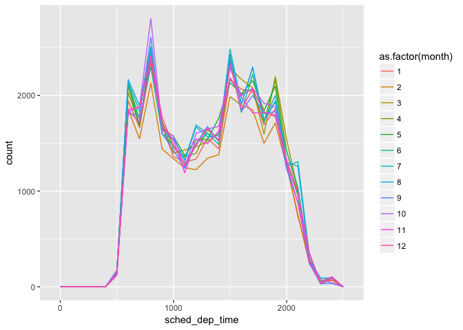
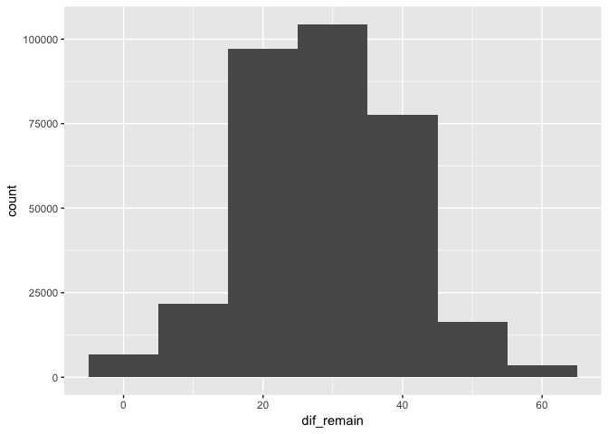
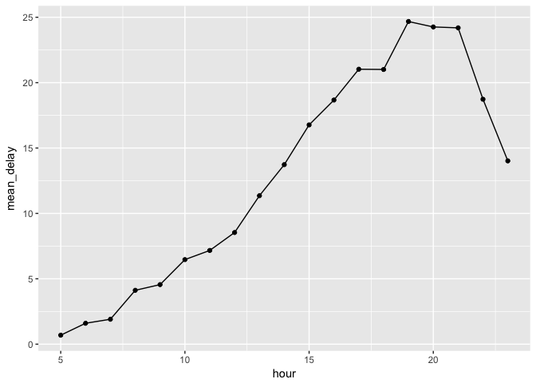
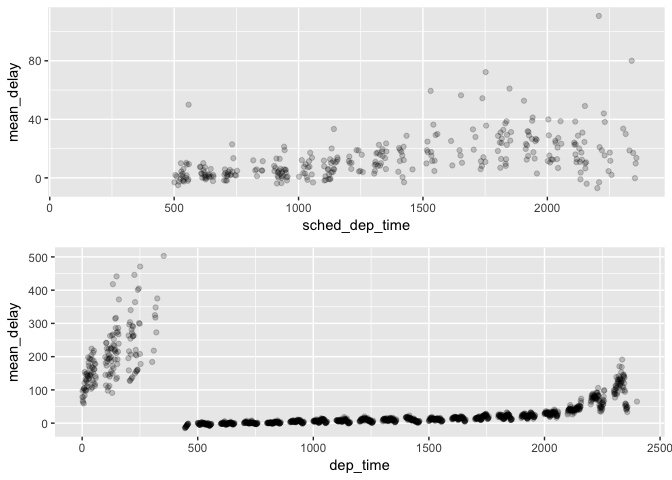
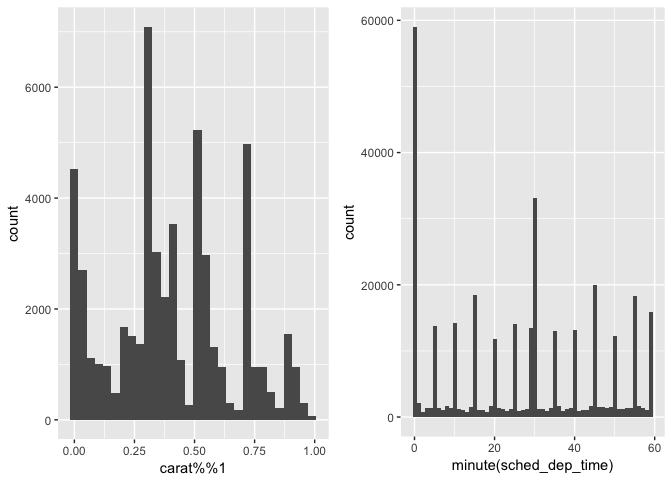

```r
library(tidyverse)
library(lubridate)
library(nycflights13)
library(gridExtra)
```

## 16.2.4 Exercises

1. What happens if you parse a string that contains invalid dates?


```r
ymd(c("2010-10-10", "bananas"))
```

```
## Warning: 1 failed to parse.
```

```
## [1] "2010-10-10" NA
```

It parses valid dates and returns `NA` for any strings it is unable to parse giving a warning message of the number of failures.

2. What does the tzone argument to `today()` do? Why is it important?

tzone sets the time zone for which you'd like the current date. Depending on the time zone, the current date can differ.

3. Use the appropriate lubridate function to parse each of the following dates:


```r
d1 <- "January 1, 2010"
mdy(d1)
```

```
## [1] "2010-01-01"
```

```r
d2 <- "2015-Mar-07"
ymd(d2)
```

```
## [1] "2015-03-07"
```

```r
d3 <- "06-Jun-2017"
dmy(d3)
```

```
## [1] "2017-06-06"
```

```r
d4 <- c("August 19 (2015)", "July 1 (2015)")
mdy(d4)
```

```
## [1] "2015-08-19" "2015-07-01"
```

```r
d5 <- "12/30/14" # Dec 30, 2014
mdy(d5)
```

```
## [1] "2014-12-30"
```

## 16.3.4 Exercises


```r
# given code
make_datetime_100 <- function(year, month, day, time) {
  make_datetime(year, month, day, time %/% 100, time %% 100)
}

flights_dt <- flights %>% 
  filter(!is.na(dep_time), !is.na(arr_time)) %>% 
  mutate(
    dep_time = make_datetime_100(year, month, day, dep_time),
    arr_time = make_datetime_100(year, month, day, arr_time),
    sched_dep_time = make_datetime_100(year, month, day, sched_dep_time),
    sched_arr_time = make_datetime_100(year, month, day, sched_arr_time)
  ) %>% 
  select(origin, dest, ends_with("delay"), ends_with("time"))
```

1. How does the distribution of flight times within a day change over the course of the year?

Changing over the course of the year requires us to choose a group. Month seems like a natural choice. I'll interpret flight times to be scheduled departure times. Binning flight times over the course of a day grouped by month shows little variation across months. The trend over the course of the day in any given month however depends heavily on how large the bins are made.


```r
flights %>%
    ggplot(aes(x = sched_dep_time, color = as.factor(month))) +
        geom_freqpoly(binwidth = 100)
```

<!-- -->

2. Compare `dep_time`, `sched_dep_time` and `dep_delay`. Are they consistent? Explain your findings.

We'd expect the difference between `dep_time` and `sched_dep_time` to equal `dep_delay` but for 1205 rows that is not the case. It seems like in most of these cases a flight is scheduled for late evening but takes off after midnight (e.g. the next day). However the date for `dep_time` has not changed.


```r
flights_dt %>%
    select(dep_delay, dep_time, sched_dep_time) %>%
    mutate(dif1 = dep_time - sched_dep_time,
           dur_delay = dminutes(dep_delay),
           dur_dif = dseconds(interval(sched_dep_time, dep_time))) %>%
    filter(dur_delay != dur_dif)
```

```
## # A tibble: 1,205 x 6
##    dep_delay dep_time            sched_dep_time      dif1  
##        <dbl> <dttm>              <dttm>              <time>
##  1      853. 2013-01-01 08:48:00 2013-01-01 18:35:00 -35220
##  2       43. 2013-01-02 00:42:00 2013-01-02 23:59:00 -83820
##  3      156. 2013-01-02 01:26:00 2013-01-02 22:50:00 -77040
##  4       33. 2013-01-03 00:32:00 2013-01-03 23:59:00 -84420
##  5      185. 2013-01-03 00:50:00 2013-01-03 21:45:00 -75300
##  6      156. 2013-01-03 02:35:00 2013-01-03 23:59:00 -77040
##  7       26. 2013-01-04 00:25:00 2013-01-04 23:59:00 -84840
##  8      141. 2013-01-04 01:06:00 2013-01-04 22:45:00 -77940
##  9       15. 2013-01-05 00:14:00 2013-01-05 23:59:00 -85500
## 10      127. 2013-01-05 00:37:00 2013-01-05 22:30:00 -78780
## # ... with 1,195 more rows, and 2 more variables: dur_delay <S4:
## #   Duration>, dur_dif <S4: Duration>
```

3. Compare `air_time` with the duration between the departure and arrival. Explain your findings. (Hint: consider the location of the airport.)

I expected the interval between `dep_time` and `arr_time` to equal `air_time`. But this is almost never the case. Based on Hadley's hint, I thought maybe this is a time zone issue. But if that were true, our errors would be off by 60 min. That's also quite rare. So it must be more complicated than that. Still a mystery to me...


```r
flights_dt %>%
    mutate(fl_span = as.period(interval(dep_time, arr_time)),
           fl_minutes = time_length(fl_span, unit = "minute"),
           dif = abs(air_time - fl_minutes),
           dif_remain = dif %% 60) %>%
    ggplot(aes(x = dif_remain)) + geom_histogram(binwidth = 10)
```

```
## Warning: Removed 717 rows containing non-finite values (stat_bin).
```

<!-- -->

4. How does the average delay time change over the course of a day? Should you use `dep_time` or `sched_dep_time`? Why?

Both could be interesting but let's look at `sched_dep_time`. If you are booking a flight and want to know about delays over the course of a day, `sched_dep_time` will be more important to you. 

A first pass at this question could group flight times by hour and plot average delays per hour. This seems reasonable. From earlier work, we know early morning flights tend to have smaller delays. Average delays continue until very late at night. Note that this is using `sched_dep_time`.


```r
flights_dt %>%
    mutate(hour = hour(sched_dep_time)) %>%
    group_by(hour) %>%
    summarize(mean_delay = mean(dep_delay)) %>%
    ggplot(aes(x = hour, y = mean_delay)) +
        geom_line() +
        geom_point()
```

<!-- -->

It's interesting if we compare a plot of delays based on `sched_dep_time` and actual `dep_time`. We see the same trend in blue, but plotting average `dep_delay` in comparison to `dep_time` is interesting. First we see flights taking off at times during which no flights are scheduled. For most of the day, the patterns are very close, but after 8pm while the blue line shows a decrease in average delays based on `sched_dep_time`, the red line shows an increase in delays based on actual `dep_time`.


```r
sched_delays <- flights_dt %>%
    mutate(hour = hour(sched_dep_time)) %>%
    group_by(hour) %>%
    summarize(sched_dep = mean(dep_delay))

dep_delays <- flights_dt %>%
    mutate(hour = hour(dep_time)) %>%
    group_by(hour) %>%
    summarize(dep = mean(dep_delay))

dep_delays %>%
    left_join(sched_delays, by = "hour") %>%
    gather(key = "dep_sched", value = "mean_delay", "sched_dep", "dep") %>%
    ggplot(aes(x = hour, y = mean_delay, color = dep_sched)) + geom_point() + geom_line()
```

```
## Warning: Removed 5 rows containing missing values (geom_point).
```

```
## Warning: Removed 5 rows containing missing values (geom_path).
```

<!-- -->

We can see more of the data itself if we do not group by hour. We first notice many flights departing at times where no flights are scheduled. We can also see, after 8pm, a much wider range of `mean_delay` times amongst `sched_dep_time` than `dep_time`.


```r
grid.arrange(
    flights %>%
        group_by(sched_dep_time) %>%
        summarize(n = n(), mean_delay = mean(dep_delay)) %>%
        ggplot(aes(x = sched_dep_time, y = mean_delay)) + geom_point(alpha = 0.2),
    flights %>%
        group_by(dep_time) %>%
        summarize(n = n(), mean_delay = mean(dep_delay)) %>%
        ggplot(aes(x = dep_time, y = mean_delay)) + geom_point(alpha = 0.2),
    ncol = 1)
```

```
## Warning: Removed 718 rows containing missing values (geom_point).
```

```
## Warning: Removed 1 rows containing missing values (geom_point).
```

<!-- -->

5. On what day of the week should you leave if you want to minimise the chance of a delay?

If you're only interested in the chance of a delay (and not its severity), we could mutate a binary `on_time` variable and calculate the proportion of `on_time` flights each day of the week. If we care about `arr_delay`, then Saturday has the highest proportion of flights on-time of any day of the day. It also has the smallest `mean_delay`.


```r
flights_dt %>%
    mutate(on_time = arr_delay <= 0,
           dow = wday(sched_dep_time, label = TRUE)) %>%
    group_by(dow) %>%
    summarize(n = n(), 
              prop_on_time = mean(on_time, na.rm = TRUE),
              mean_delay = mean(arr_delay, na.rm = TRUE)) %>%
    arrange(-prop_on_time)
```

```
## # A tibble: 7 x 4
##   dow       n prop_on_time mean_delay
##   <ord> <int>        <dbl>      <dbl>
## 1 Sat   37896        0.681      -1.45
## 2 Sun   45583        0.622       4.82
## 3 Tue   49223        0.596       5.39
## 4 Wed   48753        0.590       7.05
## 5 Mon   49398        0.578       9.65
## 6 Fri   48642        0.566       9.07
## 7 Thu   48568        0.544      11.7
```

6. What makes the distribution of `diamonds$carat` and `flights$sched_dep_time` similar?

We might assume both have smooth distributions given their numeric nature, but both reveal how humans prefer rounding to "nice" numbers. It's much more common to have flights scheduled for a multiple of 5 than any other minute from 0 to 60.


```r
grid.arrange(
    ggplot(diamonds, aes(x = carat %% 1)) + geom_histogram(),
    ggplot(flights_dt, aes(x = minute(sched_dep_time))) +
        geom_histogram(binwidth = 1),
    ncol = 2)
```

```
## `stat_bin()` using `bins = 30`. Pick better value with `binwidth`.
```

<!-- -->

7. Confirm my hypothesis that the early departures of flights in minutes 20-30 and 50-60 are caused by scheduled flights that leave early. Hint: create a binary variable that tells you whether or not a flight was delayed.

I'm not really able to confirm this. If I cut scheduled departure times into 6 bins (every 10 minutes) for an hour, and calculate proportion of flights early or the mean `dep_delay`, bins 20-30 and 50-60 do not fare better than others. 


```r
flights_dt %>%
    mutate(early = dep_delay < 0,
           sched_minute = minute(sched_dep_time),
           bin_sched_min = cut_interval(sched_minute, length = 10)) %>%
    group_by(bin_sched_min) %>%
    summarize(n = n(), mean_dep_delay = mean(dep_delay), early_prop = mean(early)) %>%
    ggplot(aes(x = bin_sched_min, y = early_prop)) + geom_col()
```

<!-- -->

## 16.4.5 Exercises

1. Why is there `months()` but no `dmonths()`?

We have `years()` and `dyears()`, `days()` and `ddays()`. The duration forms of these add  the strict duration of elapsed seconds without regard for geopolitical phenomena that human calendars introduce, such as daylight savings time or leap years.

We can add a period of n months with `months()` but a month is not a consistent duration in terms of elapsed seconds because months have differing numbers of seconds in them.

2. Explain `days(overnight * 1)` to someone who has just started learning R. How does it work?

We saw this in the code below. "overnight" is binary T/F variable created from a logical expression. `TRUE` values of this variable evaluate to 1 and `FALSE` values evaluate to 0. Therefore the expression inside the parentheses acts as a filter. For `TRUE` values, the expression evaluates to `days(1)` and for `FALSE` values, `days(0)`. `days()` is a function that creates a period object with the specified values (0 or 1). So it ends up adding a period of 1 day when `overnight` is `TRUE` and remains the same for `FALSE` values.


```r
flights_dt %>% 
  mutate(
    overnight = arr_time < dep_time,
    arr_time = arr_time + days(overnight * 1),
    sched_arr_time = sched_arr_time + days(overnight * 1)
  )
```

```
## # A tibble: 328,063 x 10
##    origin dest  dep_delay arr_delay dep_time           
##    <chr>  <chr>     <dbl>     <dbl> <dttm>             
##  1 EWR    IAH          2.       11. 2013-01-01 05:17:00
##  2 LGA    IAH          4.       20. 2013-01-01 05:33:00
##  3 JFK    MIA          2.       33. 2013-01-01 05:42:00
##  4 JFK    BQN         -1.      -18. 2013-01-01 05:44:00
##  5 LGA    ATL         -6.      -25. 2013-01-01 05:54:00
##  6 EWR    ORD         -4.       12. 2013-01-01 05:54:00
##  7 EWR    FLL         -5.       19. 2013-01-01 05:55:00
##  8 LGA    IAD         -3.      -14. 2013-01-01 05:57:00
##  9 JFK    MCO         -3.       -8. 2013-01-01 05:57:00
## 10 LGA    ORD         -2.        8. 2013-01-01 05:58:00
## # ... with 328,053 more rows, and 5 more variables: sched_dep_time <dttm>,
## #   arr_time <dttm>, sched_arr_time <dttm>, air_time <dbl>,
## #   overnight <lgl>
```


3. Create a vector of dates giving the first day of every month in 2015. Create a vector of dates giving the first day of every month in the *current* year.


```r
first_day_month_15 <- ymd('2015-01-01') + months(0:11)
first_day_month_pres <- floor_date(today("UTC"), unit = "year") + months(0:11)

first_day_month_15
```

```
##  [1] "2015-01-01" "2015-02-01" "2015-03-01" "2015-04-01" "2015-05-01"
##  [6] "2015-06-01" "2015-07-01" "2015-08-01" "2015-09-01" "2015-10-01"
## [11] "2015-11-01" "2015-12-01"
```

```r
first_day_month_pres
```

```
##  [1] "2018-01-01" "2018-02-01" "2018-03-01" "2018-04-01" "2018-05-01"
##  [6] "2018-06-01" "2018-07-01" "2018-08-01" "2018-09-01" "2018-10-01"
## [11] "2018-11-01" "2018-12-01"
```

4. Write a function that given your birthday (as a date), returns how old you are in years.

The function expects a string in year month day format.


```r
your_age <- function(bday) {
  (ymd(bday) %--% today()) %/% years(1)
}

your_age("1990 March 19")
```

```
## Note: method with signature 'Timespan#Timespan' chosen for function '%/%',
##  target signature 'Interval#Period'.
##  "Interval#ANY", "ANY#Period" would also be valid
```

```
## [1] 28
```

```r
your_age("1990-03-19")
```

```
## [1] 28
```

5. Why can’t `(today() %--% (today() + years(1)) / months(1)` work?

Other than missing a closing parentheses, it seems fine.


```r
#(today() %--% (today() + years(1)) / months(1)
(today() %--% (today() + years(1)) / months(1))
```

```
## [1] 12
```

