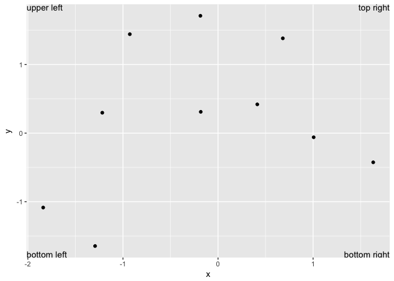

```r
library(tidyverse)
library(gridExtra)
```

## 28.2.1 Exercises

1. Create one plot on the fuel economy data with customised `title`, `subtitle`, `caption`, `x`, `y`, and `colour` labels.


```r
ggplot(mpg, aes(cty, hwy)) +
  geom_point(aes(colour = class)) +
  geom_smooth(method = "loess", se = FALSE) +
  labs(
    title = "City and Highway MPG have a strong positive correlation",
    subtitle = "This relationship holds across car types",
    caption = "Data from fueleconomy.gov",
    x = "City fuel economy (mpg)",
    y = "Highway fuel economy (mpg)",
    colour = "Car type"
  )
```

<!-- -->

2. The `geom_smooth()` is somewhat misleading because the `hwy` for large engines is skewed upwards due to the inclusion of lightweight sports cars with big engines. Use your modelling tools to fit and display a better model.

Here's the original the question references:


```r
ggplot(mpg, aes(displ, hwy)) +
  geom_point(aes(colour = class)) +
  geom_smooth(method = "loess", se = FALSE) +
  labs(
    title = "Fuel efficiency generally decreases with engine size",
    subtitle = "Two seaters (sports cars) are an exception because of their light weight",
    caption = "Data from fueleconomy.gov",
    x = "Engine displacement (L)",
    y = "Highway fuel economy (mpg)",
    colour = "Car type"
  )
```

<!-- -->

One simple option would be to just change the `geom_smooth` method to "lm". We could also model the relationship amongst each car type. While it's a little crowded, we can clearly see a downward relationship amongst all car types, though for some it's much steeper. 


```r
ggplot(mpg, aes(displ, hwy, colour = class)) +
  geom_point(aes(colour = class)) +
  geom_smooth(method = "lm", se = FALSE) +
  labs(
    title = "Fuel efficiency generally decreases with engine size",
    subtitle = "Two seaters (sports cars) are an exception because of their light weight",
    caption = "Data from fueleconomy.gov",
    x = "Engine displacement (L)",
    y = "Highway fuel economy (mpg)",
    colour = "Car type"
  )
```

<!-- -->

3. Take an exploratory graphic that you’ve created in the last month, and add informative titles to make it easier for others to understand.

See tidytuesday repo.

## 28.3.1 Exercises

1. Use `geom_text()` with infinite positions to place text at the four corners of the plot.

Here's one example. 


```r
corners <- tribble(
    ~x, ~y, ~text, ~vjust, ~hjust,
    -Inf, -Inf, "bottom left", "bottom", "left",
    -Inf, Inf, "upper left", "top", "left",
    Inf, -Inf, "bottom right", "bottom", "right",
    Inf, Inf, "top right", "top", "right"
)

ggplot(data = tibble(x = rnorm(10), y = rnorm(10)), 
       aes(x = x, y = y)) +
    geom_point() +
    geom_text(aes(label = text, vjust = vjust, hjust = hjust), data = corners)
```

<!-- -->


2. Read the documentation for `annotate()`. How can you use it to add a text label to a plot without having to create a tibble?

`annotate()` adds geoms to a plot, but unlike a typical geom function, the properties of the geoms are not mapped from variables of a data frame, but are instead passed in as vectors. For example,


```r
ggplot(mpg, aes(x = displ, y = hwy, color = class)) +
    geom_point() +
    annotate("text", x = 6, y = 28, label = "2 seaters", size = 3) +
    annotate("rect", xmin = 5.5, xmax = 7.1, ymin = 22, ymax = 27, alpha = 0.2) +
    annotate("pointrange", x = 1.5, y = mean(mpg$cty), 
             ymin = min(mpg$cty), ymax = max(mpg$cty), colour = "red") +
    annotate("text", x = 2.4, y = 12, label = "cty mpg range and mean", size = 3)
```

<!-- -->

3. How do labels with `geom_text()` interact with faceting? How can you add a label to a single facet? How can you put a different label in each facet? (Hint: think about the underlying data.)

Without faceting, if we wanted to add labels, we'd create a dataframe with the desired labels and the intended destination via the variables needed.


```r
tag <- mpg %>%
    summarize(
       displ = max(displ),
       hwy = max(hwy),
       label = "Label text"
)

ggplot(mpg, aes(x = displ, y = hwy)) +
    geom_point() +
    geom_text(data = tag, aes(label = label), vjust = "top", hjust = "right")
```

<!-- -->

If we facet the plot, without changing the datframe holding the labels, the label is repeated in each dataframe because the data argument of tag is not circumscribed by the faceting variable.


```r
ggplot(mpg, aes(x = displ, y = hwy)) +
    geom_point() +
    facet_wrap(~ drv) +
    geom_text(data = tag, aes(label = label), vjust = "top", hjust = "right")
```

<!-- -->

If we add a specific value for the faceting variable in the label dataframe, the label is added only to that facet. The key, as Hadley points out, is to think about the underlying data being sent to the `geom_text` argument, rather than the plot at large.


```r
tag <- tibble(
    displ = max(mpg$displ),
    hwy = max(mpg$hwy),
    drv = unique(mpg$drv),
    label = stringr::str_c("Label text ", drv)
)

ggplot(mpg, aes(x = displ, y = hwy)) +
    geom_point() +
    facet_wrap(~ drv) +
    geom_text(data = tag, aes(label = label), vjust = "top", hjust = "right")
```

<!-- -->

4. What arguments to `geom_label()` control the appearance of the background box?

They all begin with `label.`:

* `label.padding` controls the amount of padding around the label.

* `label.r` controls the radius of rounded corners

* `label.size` controls the size of label borders.

For example, 


```r
best_in_class <- mpg %>%
  group_by(class) %>%
  filter(row_number(desc(hwy)) == 1)

ggplot(mpg, aes(displ, hwy)) +
  geom_point(aes(colour = class)) +
  geom_point(size = 3, shape = 1, data = best_in_class) +
  ggrepel::geom_label_repel(aes(label = model), data = best_in_class,
                            label.padding = 0.5, # default is 0.25
                            label.r = 0.8, # default is 0.15
                            label.size = 0.5) # default is 0.25
```

<!-- -->

5. What are the four arguments to `arrow()`? How do they work? Create a series of plots that demonstrate the most important options.

`grid`'s `arrow()` describes arrows to add to a line. Arguments include `angle`, `length`, `ends`, and `type`. Using it inside an `annotate()` call seems to be the most useful option. For example,


```r
ggplot(mpg, aes(displ, hwy)) +
    geom_point() +
    annotate("segment", x = 6, y = 35, xend = 6.9, yend = 25,
             arrow = arrow(length = unit(0.25, "inches"), ends = "last", type = "open")) +
    annotate("text", x = 5.7, y = 35.5, label = "Corvette")
```

<!-- -->

## 28.4.4 Exercises

1. Why doesn’t the following code override the default scale?

In  the plot on the left, `geom_hex()` maps case counts to the hexagon fill. Therefore, as done in the plot on the right, we need to use `scale_fill_gradient()` in order to override the default scale.


```r
df <- tibble(
  x = rnorm(10000),
  y = rnorm(10000)
)

grid.arrange(
    ggplot(df, aes(x, y)) +
      geom_hex() +
      scale_color_gradient(low = "white", high = "red") +
      coord_fixed(),
    ggplot(df, aes(x, y)) +
      geom_hex() +
      scale_fill_gradient(low = "white", high = "red") +
      coord_fixed(),
    ncol = 2
)    
```

<!-- -->

2. What is the first argument to every scale? How does it compare to `labs()`?

The first argument to every scale is `name`. If NULL, the default, the name of the scale is taken from the first mapping used for that aesthetic, and so we can get the same output as if we used `labs()`. Compare the two examples below.


```r
grid.arrange(
    ggplot(mpg, aes(x = displ, y = hwy)) +
        geom_point() +
        labs(x = "Engine displacement (L)", y = "Highway fuel economy (mpg)"),
    ggplot(mpg, aes(x = displ, y = hwy)) +
        geom_point() +
        scale_x_continuous("Engine displacement (L)") +
        scale_y_continuous("Highway fuel economy (mpg)"),
    ncol = 2
  )
```

<!-- -->

3. Change the display of the presidential terms by:

* Combining the two variants shown above.

* Improving the display of the y axis.

* Labelling each term with the name of the president.

* Adding informative plot labels.

* Placing breaks every 4 years (this is trickier than it seems!).

In order to place breaks every 4 years, I made a separate vector of Dates and used that as the breaks argument for `scale_x_date()`. The y labels were made by concatenating row id and name into one ordered factor.


```r
election_years <- lubridate::make_date(
    year = seq(lubridate::year(min(presidential$start)),
             lubridate::year(max(presidential$end)),
             by = 4), 
    month = 1L, 
    day = 1L) 

presi <- presidential %>%
  mutate(id = 33 + row_number(),
         name_id = stringr::str_c(name, " (", id, ")"),
         name_id = factor(name_id, levels = name_id))
    
ggplot(presi, aes(start, name_id, colour = party)) +
    geom_point() +
    geom_segment(aes(xend = end, yend = name_id)) +
    scale_colour_manual(values = c(Republican = "red", Democratic = "blue")) +
    scale_y_discrete(NULL) +
    scale_x_date(NULL, breaks = election_years, date_labels = "'%y") +
    labs(
        title = "Presidential Terms by Party"
    ) +
    theme(panel.grid.minor = element_blank())
```

<!-- -->

4. Use `override.aes` to make the legend on the following plot easier to see.

We need to override the alpha level in the legend to make the color easier to see. We can do that by adding the line below.


```r
grid.arrange(
    ggplot(diamonds, aes(carat, price)) +
        geom_point(aes(colour = cut), alpha = 1/20),
    ggplot(diamonds, aes(carat, price)) +
        geom_point(aes(colour = cut), alpha = 1/20) +
        guides(colour = guide_legend(override.aes = list(alpha = 1))),
    ncol = 2
)    
```

<!-- -->
