## 3.2.4 First Steps Exercises
1. Run ggplot(data = mpg). What do you see?

We see a blank grid space because no geom layer has been called.

```r
ggplot(data = mpg)
```

<!-- -->

2. How many rows are in mpg? How many columns?


```r
dim(mpg)
```

```
## [1] 234  11
```

`mpg` has 234 rows and 11 columns.

3. What does the drv variable describe? Read the help for ?mpg to find out.


```r
?mpg
```

The `drv` variable denotes front-wheel drive as `f`, rear wheel drive as `r` and 4wd as `4`.

4. Make a scatterplot of hwy vs cyl.


```r
ggplot(mpg, aes(x = cyl, y = hwy)) +
    geom_point()
```

<!-- -->

5. What happens if you make a scatterplot of class vs drv? Why is the plot not useful?


```r
ggplot(mpg, aes(x = drv, y = class)) +
    geom_point()
```

<!-- -->

`class` and `drv` are both categorical variables, and so a scatterplot is an inappropriate choice because we cannot see how many observations fall into each location. The points lie directly on top of each other.

If we wanted to see the distribution of `drv` for each `class`, a better plot would be a barplot.


```r
ggplot(mpg, aes(x = factor(class), fill = factor(drv))) +
  geom_bar(position = "dodge")
```

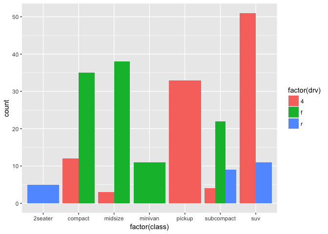<!-- -->

## 3.3.1 Aesthetic Mappings Exercises

1. What’s gone wrong with this code? Why are the points not blue?


```r
ggplot(data = mpg) + 
  geom_point(mapping = aes(x = displ, y = hwy, color = "blue"))
```

<!-- -->

The problem is that color is mapped to an aesthetic. If we wanted to make the points blue, we would remove color from the aesthetic mapping.


```r
ggplot(data = mpg) + 
  geom_point(mapping = aes(x = displ, y = hwy), color = "blue")
```

<!-- -->

2. Which variables in mpg are categorical? Which variables are continuous? (Hint: type ?mpg to read the documentation for the dataset). How can you see this information when you run mpg?


```r
str(mpg)
```

```
## Classes 'tbl_df', 'tbl' and 'data.frame':	234 obs. of  11 variables:
##  $ manufacturer: chr  "audi" "audi" "audi" "audi" ...
##  $ model       : chr  "a4" "a4" "a4" "a4" ...
##  $ displ       : num  1.8 1.8 2 2 2.8 2.8 3.1 1.8 1.8 2 ...
##  $ year        : int  1999 1999 2008 2008 1999 1999 2008 1999 1999 2008 ...
##  $ cyl         : int  4 4 4 4 6 6 6 4 4 4 ...
##  $ trans       : chr  "auto(l5)" "manual(m5)" "manual(m6)" "auto(av)" ...
##  $ drv         : chr  "f" "f" "f" "f" ...
##  $ cty         : int  18 21 20 21 16 18 18 18 16 20 ...
##  $ hwy         : int  29 29 31 30 26 26 27 26 25 28 ...
##  $ fl          : chr  "p" "p" "p" "p" ...
##  $ class       : chr  "compact" "compact" "compact" "compact" ...
```

`manufacturer`, `model`, `cyl`, `trans`, `drv`, `fl`, and `class` are categorical variables. `displ`, `year`, `cty` and `hwy` are continuous variables. 

3. Map a continuous variable to color, size, and shape. How do these aesthetics behave differently for categorical vs. continuous variables?

A continuous variable cannot be mapped to shape. Mapping a continuous variable to color maps the points by a shaded spectrum. Mapping a continuous variable by size increases the size of the points depending on the value.


```r
# continuous variable mapped to color
p1 <- ggplot(mpg, aes(x = displ, y = hwy)) + 
  geom_point(aes(color = cty))

# continuous variable mapped to size
p2 <- ggplot(mpg, aes(x = displ, y = hwy)) + 
  geom_point(aes(size = cty))

grid.arrange(p1, p2, ncol = 2)
```

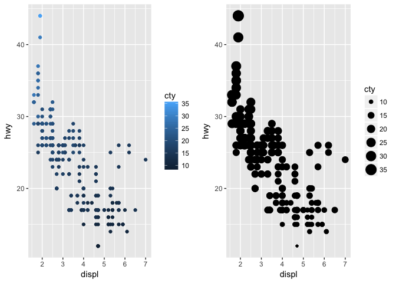<!-- -->


4. What happens if you map the same variable to multiple aesthetics?

There's no inherent problem in mapping the same variable to multiple aesthetics. Here I've mapped `cyl` to both color and shape. But it would be confusing to the viewer.


```r
ggplot(data = mpg) + 
  geom_point(mapping = aes(x = displ, y = hwy, 
                           color = factor(cyl), shape = factor(cyl)))
```

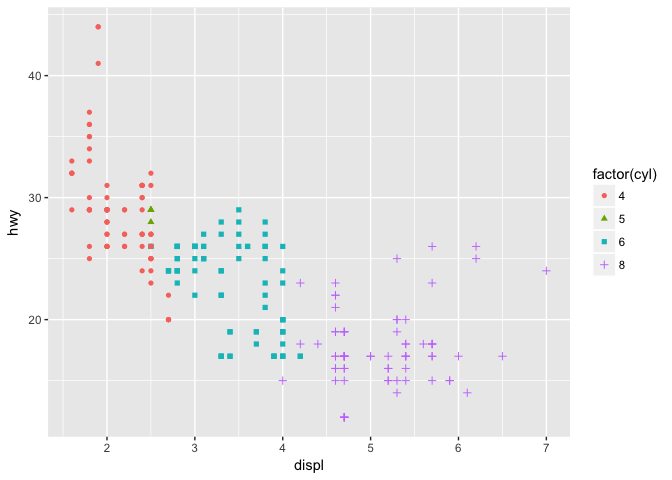<!-- -->


5. What does the stroke aesthetic do? What shapes does it work with? (Hint: use ?geom_point)

The stroke aesthetic modifies the width of the border of the point. It seems to work with all shapes.

```r
p1 <- ggplot(data = mpg, aes(x = displ, y = hwy)) + 
  geom_point(shape = 1, stroke = 5)

p2 <- ggplot(data = mpg, aes(x = displ, y = hwy)) + 
  geom_point(shape = 17, stroke = 4)

p3 <- ggplot(data = mpg, aes(x = displ, y = hwy)) + 
  geom_point(shape = 23, stroke = 3)

p4 <- ggplot(data = mpg, aes(x = displ, y = hwy)) + 
  geom_point(shape = 9, stroke = 2)

grid.arrange(p1, p2, p3, p4, ncol = 2)
```

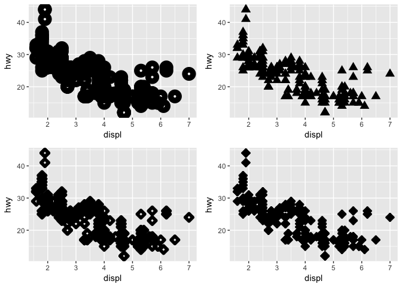<!-- -->

6. What happens if you map an aesthetic to something other than a variable name, like aes(colour = displ < 5)?

R colors the points according to the logical vector.


```r
ggplot(data = mpg, aes(x = displ, y = hwy)) + 
  geom_point(aes(colour = displ < 5))
```

<!-- -->

## 3.5.1 Facets Exercises

1. What happens if you facet on a continuous variable?

Faceting on a continuous variable will convert the variable to a factor variable and facet on all unique values as can be seen below.


```r
ggplot(data = mpg) + 
  geom_point(mapping = aes(x = displ, y = hwy)) + 
  facet_wrap( ~ cty)
```

<!-- -->


2. What do the empty cells in plot with facet_grid(drv ~ cyl) mean? How do they relate to this plot?

The empty cells in the plot below mean that there were no observations for those particular combinations of `drv` and `cyl`.


```r
ggplot(data = mpg) + 
  geom_point(mapping = aes(x = displ, y = hwy)) + 
  facet_grid(drv ~ cyl)
```

<!-- -->

These empty plots correspond to the same combinations missing a point in the plot below.


```r
ggplot(data = mpg) + 
  geom_point(mapping = aes(x = drv, y = cyl))
```

<!-- -->

3. What plots does the following code make? What does . do?

The first facets on `drv`, setting each level as a row. The second facets on `cyl`, setting each level as a column. The "." is the stand-in for `facet_grid` when only one variable is called for faceting.


```r
ggplot(data = mpg) + 
  geom_point(mapping = aes(x = displ, y = hwy)) +
  facet_grid(drv ~ .)
```

<!-- -->

```r
ggplot(data = mpg) + 
  geom_point(mapping = aes(x = displ, y = hwy)) +
  facet_grid(. ~ cyl)
```

<!-- -->

4. Take the first faceted plot in this section:


```r
ggplot(data = mpg) + 
  geom_point(mapping = aes(x = displ, y = hwy)) + 
  facet_wrap(~ class, nrow = 2)
```

<!-- -->

What are the advantages to using faceting instead of the colour aesthetic? What are the disadvantages? How might the balance change if you had a larger dataset?

The advantages to faceting instead of using the colour aesthetic is being able to individually see each level on its own plot. This makes it easier to see the individual trend for each level without any overplotting or distraction. The disadvantage is that it becomes more difficult to compare levels to each other across subplots. As the dataset gets larger (more observations), facets might be a better choice to reduce overplotting. The number of levels is also important to determine if faceting is a good option. Having too many levels might force you to facet instead of filling by colour.

5. Read ?facet_wrap. What does nrow do? What does ncol do? What other options control the layout of the individual panels? Why doesn’t facet_grid() have nrow and ncol argument?

The `nrow` argument of `facet_wrap` lays out how many rows the facets should be plotted into. The `ncol` argument does the same for columns. So if there are 7 levels (as in the plot above), setting `nrow` to 2 means that there will be 4 columns.

6. When using facet_grid() you should usually put the variable with more unique levels in the columns. Why?

This decision boils down to what appears most visually simplistic and easier to scan across comparing rows or columns.

## 3.6.1 Geometric Objects Exercises

1. What geom would you use to draw a line chart? A boxplot? A histogram? An area chart?

For a line chart, `geom_line`; a boxplot, `geom_boxplot`; a histogram, `geom_histogram`; an area chart, `geom_area`.

2. Run this code in your head and predict what the output will look like. Then, run the code in R and check your predictions.

We first have a point geom indicating a scatterplot. Because color is included in the ggplot's aesthetics, all subsequent geom's will include this. Therefore both the scatterplot points are colored and the linear models of the smooth geom are also colored.


```r
ggplot(data = mpg, mapping = aes(x = displ, y = hwy, color = drv)) + 
  geom_point() + 
  geom_smooth(se = FALSE)
```

<!-- -->

3. What does show.legend = FALSE do? What happens if you remove it? Why do you think I used it earlier in the chapter?

`show.legend = FALSE` removes the legend from the plot. Removing it shows the legend by default. It was used earlier in the chapter because it wasn't really necessary. We understood the data by this point and the plots would fit nicer on one line without a legend.

4. What does the se argument to geom_smooth() do?

The `se` argument of `geom_smooth` controls the standard error. By default it displays a confidence interval around the model.

5. Will these two graphs look different? Why/why not?


```r
p1 <- ggplot(data = mpg, mapping = aes(x = displ, y = hwy)) + 
  geom_point() + 
  geom_smooth()
p2 <- ggplot() + 
  geom_point(data = mpg, mapping = aes(x = displ, y = hwy)) + 
  geom_smooth(data = mpg, mapping = aes(x = displ, y = hwy))
grid.arrange(p1, p2, ncol = 2)
```

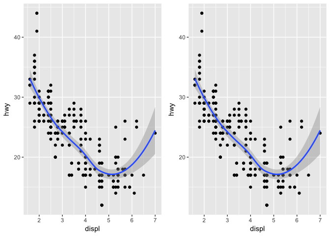<!-- -->

The graphs will appear the same because their mappings are the same. The first is preferable though to avoid repetition.

6. Recreate the R code necessary to generate the following graphs.


```r
p1 <- ggplot(data = mpg, aes(x = displ, y = hwy)) +
    geom_point() +
    geom_smooth(se = FALSE)
p2 <- ggplot(data = mpg, aes(x = displ, y = hwy)) +
    geom_point() +
    geom_smooth(se = FALSE, aes(group = drv))
p3 <- ggplot(data = mpg, aes(x = displ, y = hwy, color = drv)) +
    geom_point() +
    geom_smooth(se = FALSE)
p4 <- ggplot(data = mpg, aes(x = displ, y = hwy)) +
    geom_point(aes(color = drv)) +
    geom_smooth(se = FALSE)
p5 <- ggplot(data = mpg, aes(x = displ, y = hwy, linetype = drv)) +
    geom_point(aes(color = drv)) +
    geom_smooth(aes(group = drv), se = FALSE)
p6 <- ggplot(data = mpg, aes(x = displ, y = hwy)) +
    geom_point(aes(fill = drv), shape = 21, color = "white", stroke = 1)

grid.arrange(p1, p2, p3, p4, p5, p6, ncol = 2)
```

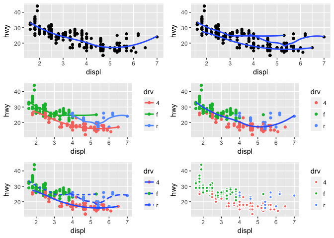<!-- -->

## 3.7.1 Statistical Transformations Exercises

1. What is the default geom associated with stat_summary()? How could you rewrite the previous plot to use that geom function instead of the stat function?

The default geom associated with `stat_summary()` is `pointrange`. The previous plot given in the textbook can be recreated by changing `stat_summary()` to `geom_pointrange()` and adding `stat = "summary"` because the default stat for `geom_pointrange()` is identity.


```r
ggplot(data = diamonds) + 
  geom_pointrange(
    mapping = aes(x = cut, y = depth),
    stat = "summary",
    fun.ymin = min,
    fun.ymax = max,
    fun.y = median
  )
```

<!-- -->


2. What does geom_col() do? How is it different to geom_bar()?

Both `geom_col()` and `geom_bar()`create bar charts. `geom_bar()` has `stat_count` by default so it sets bar heights proportional to number of cases per group. `geom_col()` has `stat_identity` so it sets bar heights to data as is.

3. Most geoms and stats come in pairs that are almost always used in concert. Read through the documentation and make a list of all the pairs. What do they have in common?

Here are the pairs for the most common geoms I use:
- geom_bar : stat_count
- geom_point : stat_identity
- geom_histogram : stat_bin
- geom_area : stat_identity
- geom_boxplot : stat_boxplot
- geom_density : stat_density

4. What variables does stat_smooth() compute? What parameters control its behaviour?

You can find this answer in the Computed Variables of the `stat_smooth` documentation. It computes: predicted value, lower pointwise confidence interval around the mean, upper pointwise confidence interval around the mean, and standard error.

Two important parameters worth mentioning are `se` to display a confidence interval or not and `method` for the choice of modeling functiong (such as a linear model).

5. In our proportion bar chart, we need to set group = 1. Why? In other words what is the problem with these two graphs?

The problem is that it is calculating the proportion for each group instead of between groups. The plots on the right give the intended fix.


```r
# original
p1 <- ggplot(data = diamonds) + 
    geom_bar(mapping = aes(x = cut, y = ..prop..))
# add group = 1
p2 <- ggplot(data = diamonds) + 
    geom_bar(mapping = aes(x = cut, y = ..prop.., group = 1))
grid.arrange(p1, p2, ncol = 2)    
```

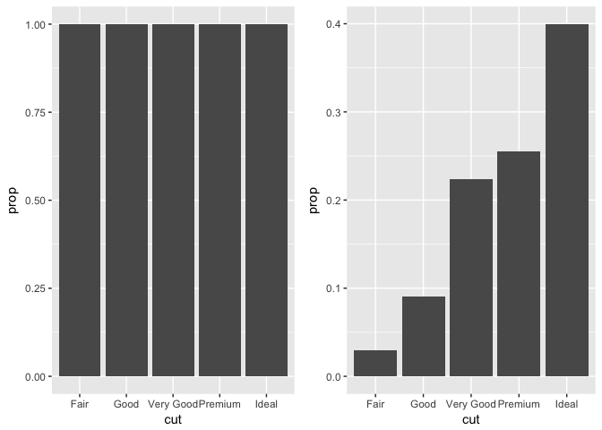<!-- -->

```r
# original
p1 <- ggplot(data = diamonds) + 
    geom_bar(mapping = aes(x = cut, fill = color, y = ..prop..))
# add group = color
p2 <- ggplot(data = diamonds) + 
    geom_bar(mapping = aes(x = cut, fill = color, y = ..prop.., group = color))
grid.arrange(p1, p2, ncol = 2)  
```

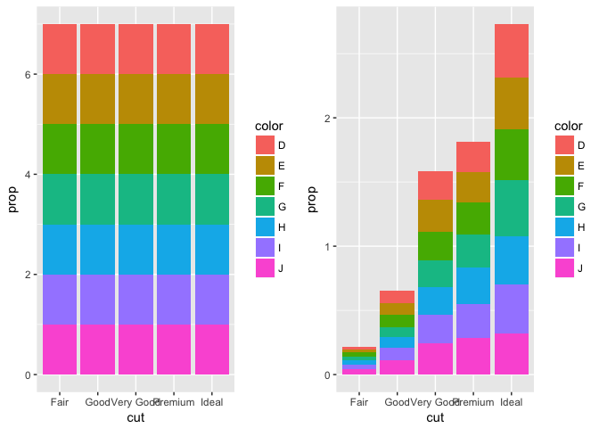<!-- -->

## 3.8.1 Position Adjustments Exercises

1. What is the problem with this plot? How could you improve it?

There's overplotting in the left hand plot because points have the same values. You can fix it by adding some jitter by changing the geom entirely or adjusting the position arugment of geom_point.


```r
# original
p1 <- ggplot(data = mpg, mapping = aes(x = cty, y = hwy)) + 
  geom_point()
# change geom to jitter
p2 <- ggplot(data = mpg, mapping = aes(x = cty, y = hwy)) + 
  geom_point(position = "jitter")
  # or geom_jitter()
grid.arrange(p1, p2, ncol = 2)
```

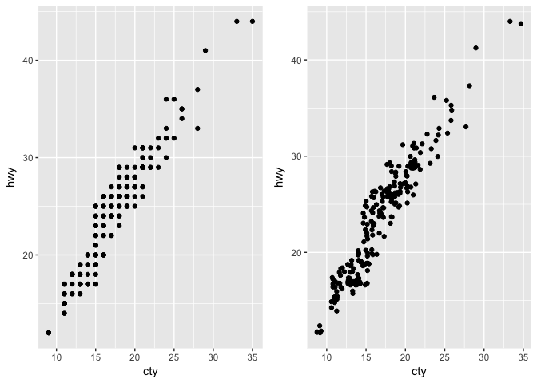<!-- -->

2. What parameters to geom_jitter() control the amount of jittering?

Width and height parameters control the amount of jittering.

3. Compare and contrast geom_jitter() with geom_count().

`geom_count()` maps observation counts to point area. Instead of adding jitter to reduce overplotting, `geom_count()` increases the size of points with multiple observations. We can compare a plot using `geom_count()` on the left and `geom_jitter()` on the right.


```r
p1 <- ggplot(data = mpg, mapping = aes(x = cty, y = hwy)) + 
  geom_count()
p2 <- ggplot(data = mpg, mapping = aes(x = cty, y = hwy)) + 
  geom_jitter()
grid.arrange(p1, p2, ncol = 2)
```

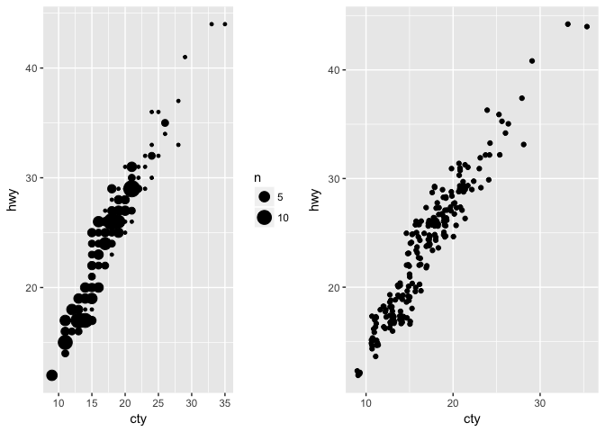<!-- -->

4. What’s the default position adjustment for geom_boxplot()? Create a visualisation of the mpg dataset that demonstrates it.

The default position adjustment is "dodge". This prevents the boxplot for each level from being plotted on top of each other. However even changing it to "identity" gave the same default result. Other positions throw an error.


```r
ggplot(data = mpg, aes(x= class, y = hwy)) +
    geom_boxplot(position = "identity")
```

<!-- -->


## 3.9.1 Coordinate Systems Exercises

1. Turn a stacked bar chart into a pie chart using coord_polar(). 

The plots on the right are pie charts taken from a stacked bar plot on the left using `coord_polar()` and setting `theta = "y"`. Neither are very effective visualizations though!


```r
p1 <- ggplot(diamonds, aes(x = factor(1), fill = cut)) +
  geom_bar()
p2 <- ggplot(diamonds, aes(x = factor(1), fill = cut)) +
  geom_bar(width = 1) +
  coord_polar(theta = "y")
p3 <- ggplot(data = mpg) + 
    geom_bar(mapping = aes(x = class, fill = drv), position = "fill")
p4 <- ggplot(data = mpg) + 
    geom_bar(mapping = aes(x = class, fill = drv), position = "fill") +
    coord_polar(theta = "y")
grid.arrange(p1, p2, p3, p4, ncol = 2)
```

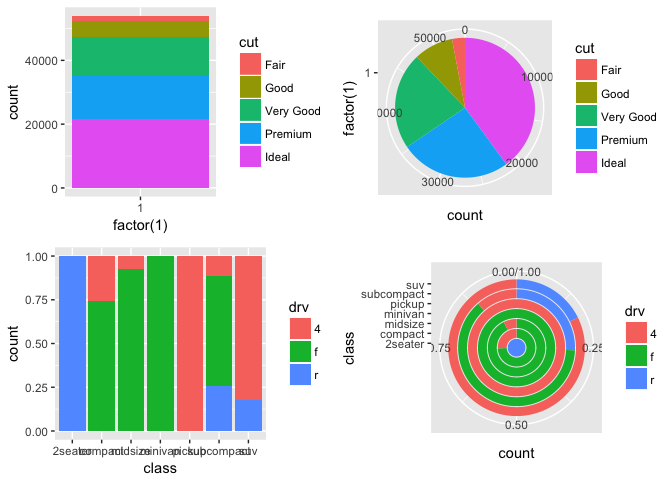<!-- -->

2. What does labs() do? Read the documentation.

`labs()` lets you modify axis, legend and plot labels. For examples see below.


```r
ggplot(data = mpg, mapping = aes(x = displ, y = hwy, color = drv)) + 
  geom_point() + 
  geom_smooth(se = FALSE) +
    labs(title = "Title here",
         subtitle = "Subtitle here",
         x = "X axis here",
         y = "Y axis here",
         caption = "caption here")
```

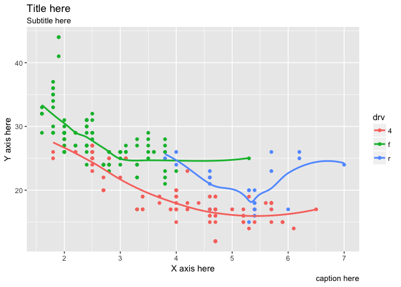<!-- -->

3. What’s the difference between coord_quickmap() and coord_map()?

According to the docs, compared to `coord_map()`, `coord_quickmap()` is a quicker approximation that preserves straight lines best for smaller areas closer to the equator. Hadley notes that quickmap sets the aspect ratio correctly for maps. Here's an example:


```r
italy <- map_data("italy")
itamap <- ggplot(italy, aes(x = long, y = lat, group = group)) +
  geom_polygon(fill = "white", colour = "black")

p1 <- itamap + coord_map()
p2 <- itamap + coord_quickmap()
grid.arrange(p1, p2, ncol = 2)
```

<!-- -->

4. What does the plot below tell you about the relationship between city and highway mpg? Why is coord_fixed() important? What does geom_abline() do?

The plot suggests that the discrepancy between city and highway mpg increases for higher mpg. `geom_abline()` represents an identity line that would show perfect correspondence. `coord_fixed()` helps maintain the aspect ratio.


```r
# original
p1 <- ggplot(data = mpg, mapping = aes(x = cty, y = hwy)) +
  geom_point() + 
  geom_abline() +
  coord_fixed()
# without coord_fixed()
p2 <- ggplot(data = mpg, mapping = aes(x = cty, y = hwy)) +
  geom_point() + 
  geom_abline()
grid.arrange(p1, p2, ncol = 2)
```

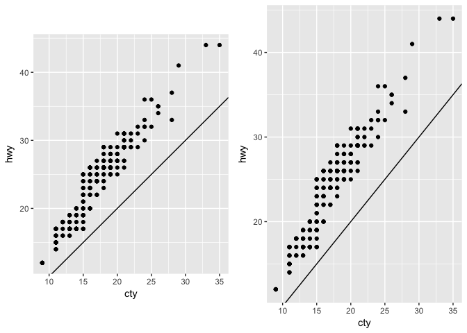<!-- -->

