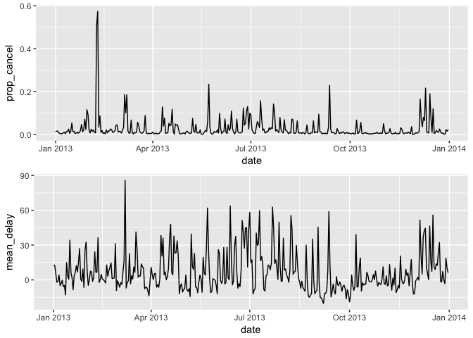
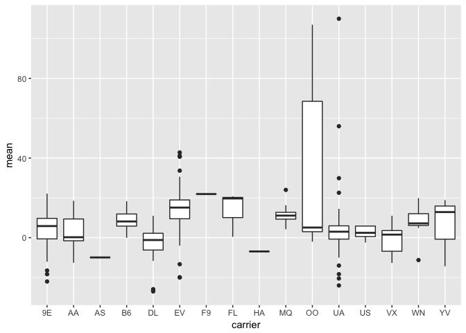
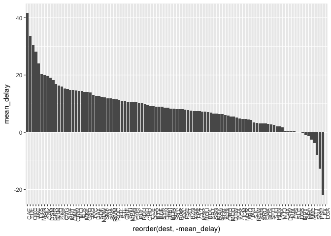
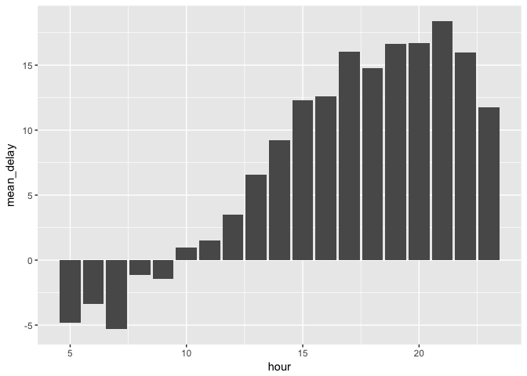
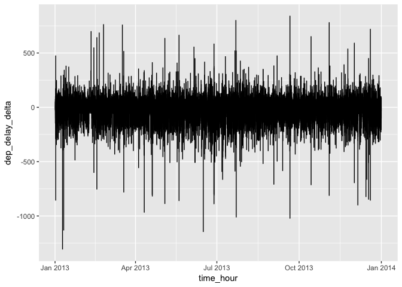
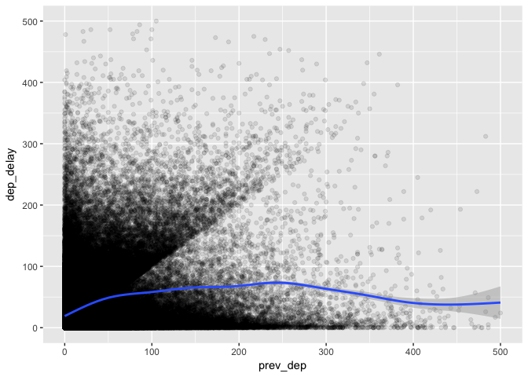

```r
library(tidyverse)
library(nycflights13)
library(stringr)
library(lubridate)
library(gridExtra)
```

## 5.2.4 filter() Exercises

1. Find all flights that


```r
flights %>% 
    # Had an arrival delay of two or more hours
    filter(arr_delay >= 120)

flights %>% 
    # Flew to Houston (IAH or HOU)
    filter(dest == "IAH" | dest == "HOU")

flights %>% 
    # Were operated by United, American, or Delta
    filter(carrier %in% c("UA", "AA", "DL"))

flights %>% 
    # Departed in summer (July, August, and September)
    filter(month %in% c(7:9))

flights %>% 
    # Arrived more than two hours late, but didn’t leave late
    filter(arr_delay >= 120 & dep_delay <= 0)

flights %>% 
    # Were delayed by at least an hour, but made up over 30 minutes in flight
    filter(dep_delay >= 60 & arr_delay < dep_delay - 30)

flights %>% 
    # Departed between midnight and 6am (inclusive)
    filter(dep_time <= 600 | dep_time == 2400)
```

2. Another useful dplyr filtering helper is between(). What does it do? Can you use it to simplify the code needed to answer the previous challenges?

`between()` is helpful to find values in a numeric vector falling in a specified range. Here's an example:


```r
# original
flights %>% 
    # Departed in summer (July, August, and September)
    filter(month %in% c(7:9))

# with between()
flights %>% 
    # Departed in summer (July, August, and September)
    filter(between(month, 7, 9))
```

3. How many flights have a missing dep_time? What other variables are missing? What might these rows represent?

8,255 flights have a missing `dep_time`. By filtering rows we can see that `dep_delay`, `arr_time`, `arr_delay`, and `air_time` are also missing so these must be cancelled flights.


```r
flights %>% 
    filter(is.na(dep_time)) %>% 
    select(dep_time, dep_delay, arr_time, air_time) %>%
    head()
```

```
## # A tibble: 6 x 4
##   dep_time dep_delay arr_time air_time
##      <int>     <dbl>    <int>    <dbl>
## 1       NA        NA       NA       NA
## 2       NA        NA       NA       NA
## 3       NA        NA       NA       NA
## 4       NA        NA       NA       NA
## 5       NA        NA       NA       NA
## 6       NA        NA       NA       NA
```


4. Why is NA ^ 0 not missing? Why is NA | TRUE not missing? Why is FALSE & NA not missing? Can you figure out the general rule? (NA * 0 is a tricky counterexample!)

We can still test logical expressions with `NA` and get `TRUE` or `FALSE` if one of the expressions evaluates to `TRUE` or `FALSE`. If we're doing some kind of numeric operation however the NA will spread with the exception of an identity like something raised to the zero power.

## 5.3.1 arrange() Exercises

1. How could you use arrange() to sort all missing values to the start? (Hint: use is.na()).

Missing values are always sorted at the end so first use a logical expression with `is.na()` to get missing values and then sort by `dep_time` if we like.


```r
flights %>%
    arrange(!is.na(dep_time), dep_time) %>% select(dep_time)

flights %>%
    arrange(!is.na(dep_time), dep_time) %>% select(dep_time)
```

2. Sort flights to find the most delayed flights. Find the flights that left earliest.


```r
# most delayed
flights %>% arrange(desc(dep_delay)) %>% select(dep_delay) %>% head()
```

```
## # A tibble: 6 x 1
##   dep_delay
##       <dbl>
## 1     1301.
## 2     1137.
## 3     1126.
## 4     1014.
## 5     1005.
## 6      960.
```

```r
# left earliest
flights %>% arrange(dep_delay) %>% select(dep_delay) %>% head()
```

```
## # A tibble: 6 x 1
##   dep_delay
##       <dbl>
## 1      -43.
## 2      -33.
## 3      -32.
## 4      -30.
## 5      -27.
## 6      -26.
```

3. Sort flights to find the fastest flights.

Assuming this means shortest `air_time`:


```r
flights %>% 
    arrange(air_time) %>% 
    select(air_time) %>% 
    head()
```

```
## # A tibble: 6 x 1
##   air_time
##      <dbl>
## 1      20.
## 2      20.
## 3      21.
## 4      21.
## 5      21.
## 6      21.
```

4. Which flights travelled the longest? Which travelled the shortest?


```r
# longest distance
flights %>% arrange(desc(distance)) %>% select(distance) %>% head()
```

```
## # A tibble: 6 x 1
##   distance
##      <dbl>
## 1    4983.
## 2    4983.
## 3    4983.
## 4    4983.
## 5    4983.
## 6    4983.
```

```r
# shortest distance
flights %>% arrange(distance) %>% select(distance) %>% head()
```

```
## # A tibble: 6 x 1
##   distance
##      <dbl>
## 1      17.
## 2      80.
## 3      80.
## 4      80.
## 5      80.
## 6      80.
```


## 5.4.1 select() Exercises

1. Brainstorm as many ways as possible to select `dep_time`, `dep_delay`, `arr_time`, and `arr_delay` from flights.

These seem to be the most obvious.


```r
flights %>% select(dep_time, dep_delay, arr_time, arr_delay)
flights %>% select(starts_with("dep"), starts_with("arr"))
flights %>% select(matches("^(dep|arr)"))
```

2. What happens if you include the name of a variable multiple times in a `select()` call?

It ignores duplicate columns without any errors, warnings or messages. For example,


```r
flights %>% select(dep_time, dep_time) %>% head()
```

```
## # A tibble: 6 x 1
##   dep_time
##      <int>
## 1      517
## 2      533
## 3      542
## 4      544
## 5      554
## 6      554
```


3. What does the `one_of()` function do? Why might it be helpful in conjunction with this vector?

`one_of()` is a `select` helper that can select variables in a character vector. If you have a long vector of column names, it's a bit cleaner to use `one_of()` with your vector. More importantly though, if you're unsure of column names for whatever reason, this gives you an option to, in a way, guess, or avoid possible errors.


```r
vars <- c("year", "month", "day", "dep_delay", "arr_delay")
flights %>% select(one_of(vars)) %>% head()
```

```
## # A tibble: 6 x 5
##    year month   day dep_delay arr_delay
##   <int> <int> <int>     <dbl>     <dbl>
## 1  2013     1     1        2.       11.
## 2  2013     1     1        4.       20.
## 3  2013     1     1        2.       33.
## 4  2013     1     1       -1.      -18.
## 5  2013     1     1       -6.      -25.
## 6  2013     1     1       -4.       12.
```

4. Does the result of running the following code surprise you? How do the select helpers deal with case by default? How can you change that default?

By default, the argument `ignore.case` is set to `TRUE` for `select` helpers. If we set the code below to `FALSE`, nothing is returned.


```r
select(flights, contains("TIME", ignore.case = FALSE))
```

```
## # A tibble: 336,776 x 0
```

## 5.5.2 mutate() Exercises

1. Currently `dep_time` and `sched_dep_time` are convenient to look at, but hard to compute with because they’re not really continuous numbers. Convert them to a more convenient representation of number of minutes since midnight.

A simple function helps accomplish this.


```r
time_in_mins <- function(x) {
  x %/% 100 * 60 + x %% 100
}

flights %>% 
    mutate(dep_time_mins = time_in_mins(dep_time),
           sched_dep_time_mins = time_in_mins(sched_dep_time)) %>%
    select(dep_time, dep_time_mins, sched_dep_time, sched_dep_time_mins) %>%
    head()
```

```
## # A tibble: 6 x 4
##   dep_time dep_time_mins sched_dep_time sched_dep_time_mins
##      <int>         <dbl>          <int>               <dbl>
## 1      517          317.            515                315.
## 2      533          333.            529                329.
## 3      542          342.            540                340.
## 4      544          344.            545                345.
## 5      554          354.            600                360.
## 6      554          354.            558                358.
```

2. Compare `air_time` with `arr_time` - `dep_time`. What do you expect to see? What do you see? What do you need to do to fix it?

We'd expect these two values to be equal, but that is rarely the case. A few reasons for this jump to mind. The first is we need the above conversion into minutes past midnight. Beyond that, there are differences in time zone, which we could derive from `origin` and `dest`. Another is flights that leave on one day (in the evening for instance) and landing the next day. But there's only 196 flights where `air_time` equals our difference calculation. So I'm missing something aside from time zone or day difference cases.


```r
flights %>% 
    mutate(
        dep_time_mins = time_in_mins(dep_time),
        arr_time_mins = time_in_mins(arr_time),
        mins_diff = arr_time_mins - dep_time_mins) %>%
    filter(mins_diff != air_time) %>%
    select(air_time, dep_time_mins, arr_time_mins, mins_diff) %>%
    head()
```

```
## # A tibble: 6 x 4
##   air_time dep_time_mins arr_time_mins mins_diff
##      <dbl>         <dbl>         <dbl>     <dbl>
## 1     227.          317.          510.      193.
## 2     227.          333.          530.      197.
## 3     160.          342.          563.      221.
## 4     183.          344.          604.      260.
## 5     116.          354.          492.      138.
## 6     150.          354.          460.      106.
```

3. Compare `dep_time`, `sched_dep_time`, and `dep_delay`. How would you expect those three numbers to be related?

I'd expect the difference between `dep_time` and `sched_dep_time` to equal `dep_delay`. This isn't the case because these aren't time representations instead of actual numbers. If we convert `dep_time` and `sched_dep_time` into minutes past midnight as we've done before, we still have a problem for 1,207 flights. The problem here is that these flights were scheduled for one day but departed on the next day.


```r
flights %>% 
    mutate(dep_time_mins = time_in_mins(dep_time),
           sched_dep_time_mins = time_in_mins(sched_dep_time),
           diff = dep_time_mins - sched_dep_time_mins) %>%
    filter(diff != dep_delay) %>%
    select(dep_time_mins, sched_dep_time_mins, diff, dep_delay, dep_time, sched_dep_time) %>%
    head()
```

```
## # A tibble: 6 x 6
##   dep_time_mins sched_dep_time_m…   diff dep_delay dep_time sched_dep_time
##           <dbl>             <dbl>  <dbl>     <dbl>    <int>          <int>
## 1          528.             1115.  -587.      853.      848           1835
## 2           42.             1439. -1397.       43.       42           2359
## 3           86.             1370. -1284.      156.      126           2250
## 4           32.             1439. -1407.       33.       32           2359
## 5           50.             1305. -1255.      185.       50           2145
## 6          155.             1439. -1284.      156.      235           2359
```


4. Find the 10 most delayed flights using a ranking function. How do you want to handle ties? Carefully read the documentation for `min_rank()`.

`min_rank()` will award ties the same rank and skip ranks as necessary when ties occur. So if three entries ties for 4th place, the next rank is 7th. But we have no ties in our top 10.


```r
flights %>%
    mutate(dep_delay_rank = min_rank(desc(dep_delay))) %>%
    arrange(dep_delay_rank) %>%
    filter(dep_delay_rank <= 10) %>%
    select(dep_delay, dep_delay_rank)
```

```
## # A tibble: 10 x 2
##    dep_delay dep_delay_rank
##        <dbl>          <int>
##  1     1301.              1
##  2     1137.              2
##  3     1126.              3
##  4     1014.              4
##  5     1005.              5
##  6      960.              6
##  7      911.              7
##  8      899.              8
##  9      898.              9
## 10      896.             10
```

5. What does `1:3` + `1:10` return? Why?

R adds the vectors together using element-wise execution and recyling. We get a warning message that the longer object's length is not a multiple of the shorter vector, but it still does the calculation.


```r
1:3 + 1:10
```

```
## Warning in 1:3 + 1:10: longer object length is not a multiple of shorter
## object length
```

```
##  [1]  2  4  6  5  7  9  8 10 12 11
```

6. What trigonometric functions does R provide?

See `?Trig`. All your favorites are there.

## 5.6.7 summarise() Exercises

1. Brainstorm at least 5 different ways to assess the typical delay characteristics of a group of flights. Consider the following scenarios:

First we group by individual flights and then calculate mean arrival delays of various lengths. Then we can use that dataframe to filter for flights that match the percentage of instances with a certain delay. Many of the given calls though return no flights because the criteria is too specific. It would be better to think in terms of `>=` or `<=`.


```r
delays <- flights %>%
    mutate(flight_code = str_c(carrier, flight)) %>%
    group_by(flight_code) %>%
    summarize(n = n(),
              mean_delay = mean(arr_delay, na.rm = TRUE),
              fifteen_early = mean(arr_delay == -15, na.rm = TRUE),
              fifteen_late = mean(arr_delay == 15, na.rm = TRUE),
              ten_late = mean(arr_delay == 10, na.rm = TRUE),
              thirty_early = mean(arr_delay == -30, na.rm = TRUE),
              thirty_late = mean(arr_delay == 30, na.rm = TRUE),
              no_delay = mean(arr_delay == 0, na.rm = TRUE),
              two_hr_late = mean(arr_delay == 120, na.rm = TRUE))
```

A flight is 15 minutes early 50% of the time, and 15 minutes late 50% of the time.


```r
delays %>%
    filter(fifteen_early == 0.5, fifteen_late == 0.5)
```

```
## # A tibble: 0 x 10
## # ... with 10 variables: flight_code <chr>, n <int>, mean_delay <dbl>,
## #   fifteen_early <dbl>, fifteen_late <dbl>, ten_late <dbl>,
## #   thirty_early <dbl>, thirty_late <dbl>, no_delay <dbl>,
## #   two_hr_late <dbl>
```

A flight is always 10 minutes late.


```r
delays %>%
    filter(ten_late == 1)
```

```
## # A tibble: 12 x 10
##    flight_code     n mean_delay fifteen_early fifteen_late ten_late
##    <chr>       <int>      <dbl>         <dbl>        <dbl>    <dbl>
##  1 9E3656          1        10.            0.           0.       1.
##  2 9E3785          2        10.            0.           0.       1.
##  3 9E3880          1        10.            0.           0.       1.
##  4 DL2254          1        10.            0.           0.       1.
##  5 EV5854          1        10.            0.           0.       1.
##  6 UA931           1        10.            0.           0.       1.
##  7 US1051          1        10.            0.           0.       1.
##  8 WN1581          1        10.            0.           0.       1.
##  9 WN2391          1        10.            0.           0.       1.
## 10 WN4149          1        10.            0.           0.       1.
## 11 WN4572          1        10.            0.           0.       1.
## 12 WN945           1        10.            0.           0.       1.
## # ... with 4 more variables: thirty_early <dbl>, thirty_late <dbl>,
## #   no_delay <dbl>, two_hr_late <dbl>
```

A flight is 30 minutes early 50% of the time, and 30 minutes late 50% of the time.


```r
delays %>%
    filter(thirty_early == 0.5, thirty_late == 0.5)
```

```
## # A tibble: 0 x 10
## # ... with 10 variables: flight_code <chr>, n <int>, mean_delay <dbl>,
## #   fifteen_early <dbl>, fifteen_late <dbl>, ten_late <dbl>,
## #   thirty_early <dbl>, thirty_late <dbl>, no_delay <dbl>,
## #   two_hr_late <dbl>
```

99% of the time a flight is on time. 1% of the time it’s 2 hours late.


```r
delays %>%
    filter(no_delay == 0.99, two_hr_late == 0.01)
```

```
## # A tibble: 0 x 10
## # ... with 10 variables: flight_code <chr>, n <int>, mean_delay <dbl>,
## #   fifteen_early <dbl>, fifteen_late <dbl>, ten_late <dbl>,
## #   thirty_early <dbl>, thirty_late <dbl>, no_delay <dbl>,
## #   two_hr_late <dbl>
```

Which is more important: arrival delay or departure delay?

In most cases, I'd say arrival delay is more important. Departure delays can be frustrating but flights often make up some time during the flight if taking off late. If you leave late but arrive on time, the departure delay isn't so important. 

2. Come up with another approach that will give you the same output as `not_cancelled %>% count(dest)` and `not_cancelled %>% count(tailnum, wt = distance)` (without using count()).

Use `group_by()` and `summarize()`.


```r
not_cancelled <- flights %>% 
  filter(!is.na(dep_delay), !is.na(arr_delay))

not_cancelled %>%
    group_by(dest) %>%
    summarize(n = n())

not_cancelled %>%
    group_by(tailnum) %>%
    summarize(n = sum(distance))
```

3. Our definition of cancelled flights (`is.na(dep_delay) | is.na(arr_delay)` ) is slightly suboptimal. Why? Which is the most important column?

All instances of missing `dep_delay` are also missing in `arr_delay`. However the reverse is not true. So by removing all cases missing `arr_delay`, we have also removed all flights missing `dep_delay`. One reason for this is flights that departed but perhaps were diverted to an airport other than their intended destination and so they are missing `arr_delay`?


```r
arr_na <- which(is.na(flights$arr_delay))
dep_na <- which(is.na(flights$dep_delay))
sum(dep_na %in% arr_na)
```

```
## [1] 8255
```

4. Look at the number of cancelled flights per day. Is there a pattern? Is the proportion of cancelled flights related to the average delay?

Looking at the proportion of cancelled flights per day is likely a better way to see a pattern. Comparing the proportion of cancelled flights and average delay reveals two line trends with a lot of noise but they do appear to be related at first glance. And this makes sense given that days with the most cancellations would likely come from bad weather, which would also lead to an increase in average delays.


```r
f1 <- flights %>%
    mutate(date = dmy(str_c(day, "-", month, "-", year))) %>%
    group_by(date) %>%
    summarize(prop_cancel = sum(is.na(arr_delay))/n(),
              mean_delay = mean(arr_delay, na.rm = TRUE))

p1 <- ggplot(f1, aes(x = date, y = prop_cancel)) +
    geom_line()
p2 <- ggplot(f1, aes(x = date, y = mean_delay)) +
    geom_line()
grid.arrange(p1, p2, ncol = 1)
```

<!-- -->

5. Which carrier has the worst delays? Challenge: can you disentangle the effects of bad airports vs. bad carriers? Why/why not? (Hint: think about `flights %>% group_by(carrier, dest) %>% summarise(n())`)

The simple answer would be to group flights by carrier and calculate mean and median `arr_delay`. `F9` is the worst, but is a much smaller carrier. `EV` is not far behind with many more flights.


```r
flights %>%
    group_by(carrier) %>%
    summarize(n = n(),
              mean = mean(arr_delay, na.rm = TRUE),
              median = median(arr_delay, na.rm = TRUE)) %>%
    arrange(desc(mean)) %>%
    head()
```

```
## # A tibble: 6 x 4
##   carrier     n  mean median
##   <chr>   <int> <dbl>  <dbl>
## 1 F9        685  21.9     6.
## 2 FL       3260  20.1     5.
## 3 EV      54173  15.8    -1.
## 4 YV        601  15.6    -2.
## 5 OO         32  11.9    -7.
## 6 MQ      26397  10.8    -1.
```

Hadley's hint for disentangling bad airports vs. bad carriers is a good start. If we calculate the mean delay for each carrrier to each destination, we can plot the distribution of mean delays for each carrier. It does show considerable variation in delays for each carrier.


```r
flights %>% 
    group_by(carrier, dest) %>% 
    summarise(n = n(), 
              mean = mean(arr_delay, na.rm = TRUE),
              median = median(arr_delay, na.rm = TRUE)) %>%
    ggplot(aes(x = carrier, y = mean)) + geom_boxplot()
```

```
## Warning: Removed 2 rows containing non-finite values (stat_boxplot).
```

<!-- -->

But this of course doesn't tell us which destinations see greater delays. If we just look at mean delay by destination, we see a wide range suggesting that destination is certainly important too. A more complete answer would benefit from examining each flight's delay compared to the average delay at that destination, having removed other flights from the same carrier.


```r
flights %>%
    group_by(dest) %>%
    summarize(mean_delay = mean(arr_delay, na.rm = TRUE)) %>%
    arrange(desc(mean_delay)) %>%
    ggplot(aes(x = reorder(dest, -mean_delay), y = mean_delay)) + geom_col() +
    theme(axis.text.x = element_text(angle = 90, hjust = 1))
```

```
## Warning: Removed 1 rows containing missing values (position_stack).
```

<!-- -->

6. What does the sort argument to `count()` do. When might you use it?

The sort argument sorts a count. It's an alternative to `arrange()`. Below examples are equivalent.


```r
flights %>%
    mutate(flight_code = str_c(carrier, flight)) %>%
    count(flight_code, sort = TRUE)
  
flights %>%
    mutate(flight_code = str_c(carrier, flight)) %>%
    count(flight_code) %>%
    arrange(desc(n))
```

## 5.7.1 Grouped mutates Exercises

1. Refer back to the lists of useful mutate and filtering functions. Describe how each operation changes when you combine it with grouping.

To give one example, if we mutate a new variable with the `min_rank()` function each observation is ranked by the chosen variable. If we place a `group_by()` before the mutate, the ranks are now done by those groups. So the top ranking for `arr_delay` pertains to the top ranking in each group.


```r
flights %>%
    mutate(min_arr_delay = min_rank(arr_delay)) %>%
    arrange(min_arr_delay) %>%
    select(carrier, flight, arr_delay, min_arr_delay) %>%
    head()
```

```
## # A tibble: 6 x 4
##   carrier flight arr_delay min_arr_delay
##   <chr>    <int>     <dbl>         <int>
## 1 VX         193      -86.             1
## 2 VX          11      -79.             2
## 3 UA         612      -75.             3
## 4 AA         269      -75.             3
## 5 AS           7      -74.             5
## 6 UA        1628      -73.             6
```

```r
flights %>%
    group_by(carrier) %>%
    mutate(min_arr_delay = min_rank(arr_delay)) %>%
    arrange(min_arr_delay) %>%
    select(carrier, flight, arr_delay, min_arr_delay) %>%
    head()
```

```
## # A tibble: 6 x 4
## # Groups:   carrier [5]
##   carrier flight arr_delay min_arr_delay
##   <chr>    <int>     <dbl>         <int>
## 1 FL         349      -44.             1
## 2 WN        1341      -58.             1
## 3 YV        2889      -46.             1
## 4 YV        2889      -46.             1
## 5 HA          51      -70.             1
## 6 F9         835      -47.             1
```

2. Which plane (tailnum) has the worst on-time record?

I think this could be answered with a `mutate()` and `filter()` following the `group_by()` but `summarise()` and `arrange()` seems much more intuitive.


```r
flights %>%
    group_by(tailnum) %>%
    summarize(mean_delay = mean(arr_delay, na.rm = TRUE)) %>%
    arrange(-mean_delay) %>%
    head()
```

```
## # A tibble: 6 x 2
##   tailnum mean_delay
##   <chr>        <dbl>
## 1 N844MH        320.
## 2 N911DA        294.
## 3 N922EV        276.
## 4 N587NW        264.
## 5 N851NW        219.
## 6 N928DN        201.
```

3. What time of day should you fly if you want to avoid delays as much as possible?

Grouping by hour gives us some insight into this question. Plotting mean arrival delay by hour suggests a clear advantage to flying early in the morning if you want to avoid delays.


```r
flights %>% 
    mutate(dep_time_mins = time_in_mins(dep_time)) %>%
    group_by(hour) %>%
    summarize(mean_delay = mean(arr_delay, na.rm = TRUE)) %>%
    ggplot(aes(x = hour, y = mean_delay)) + geom_col()
```

```
## Warning: Removed 1 rows containing missing values (position_stack).
```

<!-- -->

4. For each destination, compute the total minutes of delay. For each, flight, compute the proportion of the total delay for its destination.

I've interpreted delay here to mean `arr_delay` but we could have just as easily added in `dep_delay` as well. According to my interpretation of the question, I computed the total minutes of delay by grouping by destination and then summing `arr_delay` in a mutate rather than a summarize. Now each observation has a total delay variable for its given destination. Then I grouped by each flight and similarly calculated a sum for each flight delay with a mutate. Lastly I calculated the proportion in a summarize so I'd have the calculation I wanted for each flight. 


```r
flights %>%
    mutate(fl_code = str_c(carrier, flight)) %>%
    group_by(dest) %>%
    mutate(total_dest_delay = sum(arr_delay, na.rm = TRUE)) %>%
    group_by(fl_code) %>%
    mutate(total_flight_delay = sum(arr_delay, na.rm = TRUE)) %>%
    summarize(prop = sum(total_flight_delay, na.rm = TRUE) / sum(total_dest_delay, na.rm = TRUE)) %>%
    head()
```

```
## # A tibble: 6 x 2
##   fl_code      prop
##   <chr>       <dbl>
## 1 9E2900   0.000807
## 2 9E2901   0.0199  
## 3 9E2902   0.00226 
## 4 9E2903   0.00546 
## 5 9E2904   0.0153  
## 6 9E2905  -0.00153
```

5. Delays are typically temporally correlated: even once the problem that caused the initial delay has been resolved, later flights are delayed to allow earlier flights to leave. Using lag() explore how the delay of a flight is related to the delay of the immediately preceding flight.

We might first plot lag over the course of the day. Not surprisingly, there's too much noise for us to spot much of a pattern.


```r
flights %>%
    arrange(time_hour) %>%
    mutate(dep_delay_delta = dep_delay - lag(dep_delay)) %>%
    ggplot(aes(x = time_hour, y = dep_delay_delta)) + geom_line()
```

```
## Warning: Removed 1 rows containing missing values (geom_path).
```

<!-- -->

A better approach would be to plot `dep_delay` vs. the `dep_delay` of the previous flight (which we can easily calculate with `lag()`). If we exclude flights with extraordinarily long delays, we see that generally a longer previously delayed flight will tend to make the next flight also have a longer delay. There's still a lot of overplotting though.


```r
flights %>%
    filter(!is.na(arr_delay)) %>%
    mutate(full_sched_dep_time = lubridate::make_datetime(year, month, day, hour, minute)) %>%
    filter(between(dep_delay, 0, 500)) %>%
    arrange(full_sched_dep_time) %>%
    mutate(prev_dep = lag(dep_delay)) %>%
    ggplot(aes(x = prev_dep, y = dep_delay)) +
        geom_point(alpha = 0.1) +
        geom_smooth()
```

```
## `geom_smooth()` using method = 'gam'
```

```
## Warning: Removed 1 rows containing non-finite values (stat_smooth).
```

```
## Warning: Removed 1 rows containing missing values (geom_point).
```

<!-- -->


6. Look at each destination. Can you find flights that are suspiciously fast? (i.e. flights that represent a potential data entry error). Compute the air time a flight relative to the shortest flight to that destination. Which flights were most delayed in the air?

I approached this by grouping non-cancelled flights by destination and calculating a z-score for each flight relative to its destination. Even though origins are slightly different, I assigned each destination the same mean and standard deviation. Then since we are looking for suspiciously short flight, filtered for flights with a z score less than 3. We get 19 flights to look into as suspiciously short.


```r
flights %>%
    filter(!is.na(arr_delay)) %>%
    mutate(fl_code = str_c(carrier, flight)) %>%
    group_by(dest) %>%
    mutate(mean_air = mean(air_time),
           sd_air = sd(air_time),
           z = (air_time - mean_air) / sd_air) %>%
    select(fl_code, dest, air_time, mean_air, sd_air, z) %>%
    filter(z < -3) %>%
    arrange(z) %>%
    head()
```

```
## # A tibble: 6 x 6
## # Groups:   dest [6]
##   fl_code dest  air_time mean_air sd_air     z
##   <chr>   <chr>    <dbl>    <dbl>  <dbl> <dbl>
## 1 EV4667  MSP        93.    151.   11.8  -4.90
## 2 DL1499  ATL        65.    113.    9.81 -4.88
## 3 EV4292  GSP        55.     93.4   8.13 -4.72
## 4 EV3805  BNA        70.    114.   11.0  -4.05
## 5 EV4687  CVG        62.     96.0   8.52 -3.98
## 6 US2132  BOS        21.     39.0   4.95 -3.63
```

This approach however doesn't catch another problem I saw: the error could be in the destination. For instance, UA1545 goes from EWR to IAH, but in one instance goes to BOS. Perhaps it was diverted although geographically that makes little sense? Perhaps just an error.

If we group by flight codes instead of destination, we can catch these types of potential errors. We get 635 observations, some with really negative z-scores which when you investigate, must have the wrong flight code or destination.


```r
flights %>%
    filter(!is.na(arr_delay)) %>%
    mutate(fl_code = str_c(carrier, flight)) %>%
    group_by(fl_code) %>%
    mutate(mean_air = mean(air_time),
           sd_air = sd(air_time),
           z = (air_time - mean_air) / sd_air) %>%
    select(fl_code, dest, air_time, mean_air, sd_air, z) %>%
    filter(z < -3) %>%
    arrange(z) %>%
    head()
```

```
## # A tibble: 6 x 6
## # Groups:   fl_code [6]
##   fl_code dest  air_time mean_air sd_air      z
##   <chr>   <chr>    <dbl>    <dbl>  <dbl>  <dbl>
## 1 DL857   PIT        57.     316.  24.9  -10.4 
## 2 UA257   MCO       136.     345.  20.2  -10.3 
## 3 UA642   IAH       191.     343.  17.7   -8.61
## 4 UA1244  CLE        74.     198.  14.6   -8.46
## 5 DL27    BOS        36.     107.   8.68  -8.16
## 6 UA1120  BOS        56.     341.  36.6   -7.78
```

7. Find all destinations that are flown by at least two carriers. Use that information to rank the carriers.

Below we can extract all of the destinations with only one carrier.


```r
flights %>%
    group_by(dest, carrier) %>%
    summarise(n = n()) %>%
    count(dest) %>%
    filter(nn < 2) %>%
    head()
```

```
## # A tibble: 6 x 2
## # Groups:   dest [6]
##   dest     nn
##   <chr> <int>
## 1 ABQ       1
## 2 ACK       1
## 3 ALB       1
## 4 ANC       1
## 5 BHM       1
## 6 BUR       1
```

We can check that with this line. B6 is the only carrier to go to ABQ.


```r
flights %>% filter(dest == "ABQ") %>% pull(carrier) %>% unique()
```

```
## [1] "B6"
```

I was unsure of the criteria for ranking the carriers. But let's rank the carriers in terms of number of destinations flown after filtering out destinations where only one carrier travels. It looks like EV tops the list.


```r
flights %>%
    group_by(dest) %>%
    filter(n_distinct(carrier) >= 2) %>%
    group_by(carrier) %>%
    summarise(n = n_distinct(dest)) %>%
    arrange(-n) %>%
    head()
```

```
## # A tibble: 6 x 2
##   carrier     n
##   <chr>   <int>
## 1 EV         51
## 2 9E         48
## 3 UA         42
## 4 DL         39
## 5 B6         35
## 6 AA         19
```

8. For each plane, count the number of flights before the first delay of greater than 1 hour.

`cumany()` is key for this.


```r
flights %>%
    mutate(full_sched_dep_time = lubridate::make_datetime(year, month, day, hour, minute)) %>%
    group_by(tailnum) %>%
    arrange(full_sched_dep_time) %>%
    filter(!cumany(arr_delay > 60)) %>%
    tally(sort = TRUE) %>%
    head()
```

```
## # A tibble: 6 x 2
##   tailnum     n
##   <chr>   <int>
## 1 N705TW     97
## 2 N765US     97
## 3 N12125     94
## 4 N320AA     94
## 5 N13110     91
## 6 N3763D     82
```


