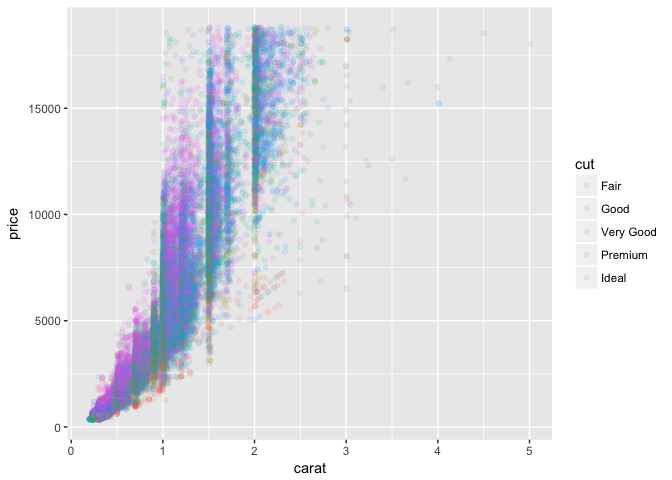
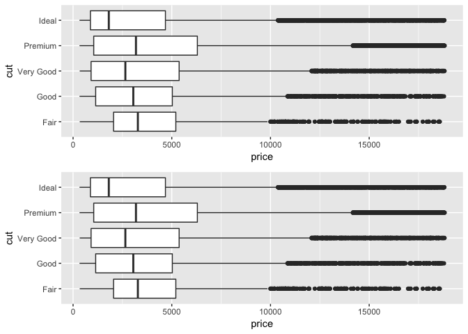
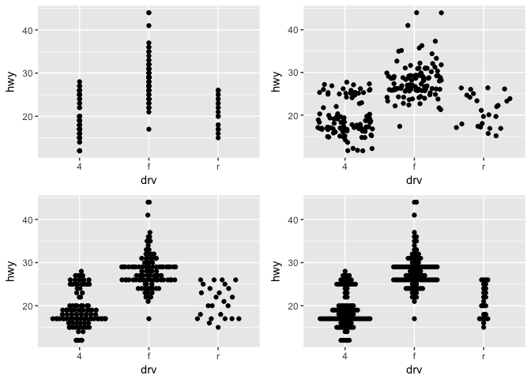

```r
library(tidyverse)
library(gridExtra)
library(GGally)
library(nycflights13)
```

## 7.3.4 Variation Exercises

1. Explore the distribution of each of the x, y, and z variables in diamonds. What do you learn? Think about a diamond and how you might decide which dimension is the length, width, and depth.

Initial histograms might lead us to believe y and z have quite similar distributions, while x is bimodal. However an outlier in y and z is giving a misleading picture.


```r
grid.arrange(ggplot(diamonds, aes(x = x)) + geom_histogram(),
             ggplot(diamonds, aes(x = y)) + geom_histogram(),
             ggplot(diamonds, aes(x = z)) + geom_histogram(),
             ncol = 3)
```

<!-- -->

We can filter to see these strange points that are likely errors of some kind.


```r
diamonds %>%
    filter(x > 11 | y > 11 | z > 11) %>%
    select(x, y, z)
```

```
## # A tibble: 3 x 3
##       x     y     z
##   <dbl> <dbl> <dbl>
## 1  8.09 58.9   8.06
## 2  5.12  5.15 31.8 
## 3  5.15 31.8   5.12
```

If we filter out those points three observations, we see x and y have very similar distributions. Z also looks to be bimodal but has a different center.


```r
grid.arrange(ggplot(diamonds %>% filter(y < 11 & z < 11), aes(x = x)) +
                 geom_histogram(),
             ggplot(diamonds %>% filter(y < 11 & z < 11), aes(x = y)) +
                 geom_histogram(),
             ggplot(diamonds %>% filter(y < 11 & z < 11), aes(x = z)) +
                 geom_histogram(),
             ncol = 3)
```

<!-- -->

This would be easier to see if we placed them on the same axes, which we can do with `geom_freqpoly()` after gathering the columns x, y, and z into key-value pairs with tidyr's `gather()`. Now we can clearly see that x and y have almost identical distributions. Z is also bimodal, but has a center to the left of x and y. According to the documentation, x is length, y is width and z is depth. I suppose if I think about how a diamond would fit into a ring, you'd want two dimensions (eg x and y) to be equal, while depth could vary depending on size.


```r
diamonds %>%
    filter(y < 11 & z < 11) %>%
    gather(key = dimension, value, x, y, z) %>%
    ggplot(aes(value, colour = dimension)) +
        geom_freqpoly()
```

<!-- -->

2. Explore the distribution of price. Do you discover anything unusual or surprising? (Hint: Carefully think about the binwidth and make sure you try a wide range of values.)

We might expect a smooth distribution of prices but instead we see a spiky distribution as we narrow the binwidths. This might be because we tend to pay in round numbers.


```r
grid.arrange(
    ggplot(diamonds %>% filter(price <= 10000), aes(x = price)) +
        geom_histogram(binwidth = 100),
    ggplot(diamonds %>% filter(price <= 10000), aes(x = price)) +
        geom_histogram(binwidth = 10),
    ggplot(diamonds %>% filter(price <= 10000), aes(x = price)) +
        geom_histogram(binwidth = 1),
    ncol = 1
)
```

<!-- -->

There are strangely no observations priced between \$1455 and \$1545.


```r
diamonds %>%
    filter(between(price, 1454, 1546)) %>%
    count(price)
```

```
## # A tibble: 2 x 2
##   price     n
##   <int> <int>
## 1  1454     3
## 2  1546    21
```

3. How many diamonds are 0.99 carat? How many are 1 carat? What do you think is the cause of the difference?

We can see a trend if we cover a few more weights on either size of this limit. The very low counts of diamonds very close to but not reaching the 1 carat mark could suggest that some diamonds were artificially rounded up so they could be marketed at 1 carat diamonds. Once we've reached the 1 carat mark, there's no evidence of rounding down.


```r
diamonds %>%
  filter(between(carat, 0.97, 1.02)) %>%
  count(carat)
```

```
## # A tibble: 6 x 2
##   carat     n
##   <dbl> <int>
## 1 0.970    59
## 2 0.980    31
## 3 0.990    23
## 4 1.00   1558
## 5 1.01   2242
## 6 1.02    883
```

4. Compare and contrast coord_cartesian() vs xlim() or ylim() when zooming in on a histogram. What happens if you leave binwidth unset? What happens if you try and zoom so only half a bar shows?

`coord_cartesian()` zooms in to an x or y-axis range. `xlim()` or `ylim()` does the same but throws the data away in the process. `xlim()` or `ylim()` gives a message indicating how much data has been removed. We can also see in `coord_cartesian()` that the data continues beyond the scope of the plot.


```r
grid.arrange(
    ggplot(diamonds, aes(x = price)) + geom_histogram(binwidth = 10) +
        xlim(c(0,5000)) + ggtitle("using xlim()"),
    ggplot(diamonds, aes(x = price)) + geom_histogram(binwidth = 10) +
        coord_cartesian(xlim = c(0,5000)) + ggtitle("using coord_cartesian()"),
    ncol = 1
)
```

```
## Warning: Removed 14714 rows containing non-finite values (stat_bin).
```

<!-- -->


## 7.4.1 Missing Values Exercises

1. What happens to missing values in a histogram? What happens to missing values in a bar chart? Why is there a difference?

In a histogram, the number of missing values removed is given in a warning message above a plot. I believe this holds for any numeric data. A bar plot however displays categorical data, and so `NA` becomes a category of its own.


```r
grid.arrange(
    diamonds %>% 
        mutate(y = ifelse(y < 3 | y > 20, NA, y)) %>%
        ggplot(aes(x = x, y = y)) + geom_point(),
    diamonds %>%
        mutate(cut = ifelse(cut == "Ideal", NA, as.character(cut))) %>%
        ggplot(aes(x = cut, y = price)) + geom_col(),
    ncol = 2
)
```

```
## Warning: Removed 9 rows containing missing values (geom_point).
```

<!-- -->

2. What does `na.rm = TRUE` do in `mean()` and `sum()`?

`na.rm = TRUE` removes missing values from the vector to be calculated. If missing values remain in a vector passed to a function like `mean()`, `sum()`, `sd()` etc., the result will be `NA`.

## 7.5.1.1 Covariation Exercises

1. Use what you’ve learned to improve the visualisation of the departure times of cancelled vs. non-cancelled flights.

A large disparity in the number of non-cancelled flights makes the original plot on the left hard to interpret. Using `geom_density()` instead of `geom_freqpoly()` standardizes the counts for each group so we can more easily compare the two distributions. Cancelled flights appear to be more likely later in the day.


```r
nycflights13::flights %>% 
  mutate(cancelled = is.na(dep_time)) %>%
    count(cancelled)
```

```
## # A tibble: 2 x 2
##   cancelled      n
##   <lgl>      <int>
## 1 FALSE     328521
## 2 TRUE        8255
```

```r
flights2 <- nycflights13::flights %>% 
  mutate(cancelled = is.na(dep_time),
         sched_hour = sched_dep_time %/% 100,
         sched_min = sched_dep_time %% 100,
         sched_dep_time = sched_hour + sched_min / 60) 

grid.arrange(
   ggplot(flights2, mapping = aes(sched_dep_time)) + 
        geom_freqpoly(mapping = aes(colour = cancelled), binwidth = 1/4),
   ggplot(flights2, mapping = aes(sched_dep_time)) + 
    geom_density(mapping = aes(colour = cancelled)),
   ncol = 2
 )
```

<!-- -->

We could also have made a boxplot to show a similar result.


```r
ggplot(flights2, aes(x = cancelled, y = sched_dep_time)) + 
    geom_boxplot() + coord_flip()
```

<!-- -->

2. What variable in the diamonds dataset is most important for predicting the price of a diamond? How is that variable correlated with cut? Why does the combination of those two relationships lead to lower quality diamonds being more expensive?

A scatterplot matrix can be useful to see a number of relationships at once. It looks like `carat` has the strongest correlation with `price`. 


```r
diamonds %>%
    select(-cut, -color, -clarity) %>%
    ggpairs()
```

<!-- -->

We can see the relationship between `carat` and `price` closer in its own plot. We can color by `cut` here but it's hard to see teh relationship.


```r
ggplot(diamonds, aes(x = carat, y = price, color = cut)) + 
    geom_point(alpha = 0.1)
```

<!-- -->

In a boxplot, it's easier to see that diamonds of the highest quality cut tend to be of a smaller `carat`, which is the most important single variable to predict the `price` of a diamond. So when we compare `cut` and `price`, it appears that the highest quality cut diamonds are the least expensive on average. However, we need to realize that `price` and `carat` co-vary. 


```r
grid.arrange(
    ggplot(diamonds, aes(x = cut, y = carat)) + geom_boxplot() + coord_flip(),
    ggplot(diamonds, aes(x = cut, y = price)) + geom_boxplot() + coord_flip(),
    ncol = 1
)
```

<!-- -->

3. Install the `ggstance` package, and create a horizontal boxplot. How does this compare to using `coord_flip()`?

`ggstance` gives us `geom_boxploth()`. Instead of setting `x` and `y` and using `coord_flip()`, with `geom_boxploth()`, we reverse the `x` and `y` variables (or set them as they would appear in the plot).


```r
library(ggstance)
grid.arrange(
    ggplot(diamonds, aes(x = cut, y = price)) + geom_boxplot() + coord_flip(),
    ggplot(diamonds, aes(y = cut, x = price)) + ggstance::geom_boxploth(),
    ncol = 1
)
```

<!-- -->

4. One problem with boxplots is that they were developed in an era of much smaller datasets and tend to display a prohibitively large number of “outlying values”. One approach to remedy this problem is the letter value plot. Install the lvplot package, and try using geom_lv() to display the distribution of price vs cut. What do you learn? How do you interpret the plots?

Having a problem installing `lvplot`...

5. Compare and contrast `geom_violin()` with a facetted `geom_histogram()`, or a coloured `geom_freqpoly()`. What are the pros and cons of each method?

Violin plots are like vertical histograms. We can see the trend for each category without any overlap. We cannot see the counts however, which would be important in many cases.


```r
ggplot(diamonds, aes(x = cut, y = price)) + geom_violin()
```

<!-- -->

The advantage of a faceted histogram is the clear picture of each sub-distribution. However this only works depending on the number of facets and can be more difficult to compare facets to other facets.


```r
ggplot(diamonds, aes(x = price)) + 
    geom_histogram(binwidth = 500) + 
    facet_wrap(~ cut)
```

<!-- -->

`geom_freqpoly()` works well in this case. At times, the overlapping lines could be hard to see each sub-distribution. Counts might need to be densities depending on the task.


```r
ggplot(diamonds, aes(x = price, color = cut)) + 
    geom_freqpoly(binwidth = 500)
```

<!-- -->

6. If you have a small dataset, it’s sometimes useful to use `geom_jitter()` to see the relationship between a continuous and categorical variable. The `ggbeeswarm` package provides a number of methods similar to `geom_jitter()`. List them and briefly describe what each one does.

Points overlap if we use a scatterplot. We can use `geom_jitter()` to avoid this problem. The `ggbeeswarm` package gives two more geoms: `geom_quasirandom()` and `geom_beeswarm()`, both of which have many options to control the jittering.


```r
library(ggbeeswarm)
grid.arrange(
    ggplot(data = mpg, aes(x = drv, y = hwy)) + geom_point(),
    ggplot(data = mpg, aes(x = drv, y = hwy)) + geom_jitter(),
    ggplot(data = mpg, aes(x = drv, y = hwy)) + geom_quasirandom(),
    ggplot(data = mpg, aes(x = drv, y = hwy)) + geom_beeswarm(),
    ncol = 2)
```

<!-- -->


## 7.5.2.1 Covariation Exercises

1. How could you rescale the count dataset above to more clearly show the distribution of cut within colour, or colour within cut?

Proportions can help with this task instead of counts.


```r
diamonds %>% 
    count(color, cut) %>%
    group_by(color) %>%
    mutate(prop = n / sum(n)) %>%
    ggplot(aes(x = color, y = cut)) +
        geom_tile(aes(fill = prop))
```

<!-- -->

2. Use `geom_tile()` together with dplyr to explore how average flight delays vary by destination and month of year. What makes the plot difficult to read? How could you improve it?

I'll start by removing cancelled flights and making a `geom_tile()` plot of mean arrival delay (I chose to use `arr_delay`) by destination and month. Aside from having very many destinations, we have blank white space indicating that, in some months, no flights flew to that destination.


```r
flights %>%
    filter(!is.na(arr_delay)) %>%
    group_by(month, dest) %>%
    summarise(mean_arr_delay = mean(arr_delay)) %>%
    ggplot(aes(x = factor(month), y = dest, fill = mean_arr_delay)) +
        geom_tile() +
        labs(x = "Month", y = "Destination", fill = "Mean Arrival Delay")
```

<!-- -->

We could filter for destinations only flown to all 12 months of the year. Another problem with the above plot is that the mean delay calculated above is not a weighted mean. For any given destination, the color of a tile for a particular month will be calculated without regard for the number of flights that went to that destination in that month. 

Moreover, in most cases what we'd be most interested to glean from a plot like this is, across all destinations, do mean delays vary seasonally? In this case we might want tile color to be reflective of the proportion of a destination's delay found in that month. This still hides variation in number of flights in each month to a destination so we can raise our filter level to remove some destinations that have very low flight numbers in a given month. We can also add the `viridis` palette to more easily spot differences in the tiles.


```r
# find destinations meeting a certain number of flights in a given month for every month
all_year_dest <- flights %>%
    filter(!is.na(arr_delay)) %>%
    count(month, dest) %>%
    filter(n > 20) %>%
    group_by(dest) %>%
    filter(length(month) == 12) %>%
    arrange(dest) %>%
    pull(dest) %>%
    unique()

# calculate total arrival delay for each destination
dest_sums <- flights %>%
    filter(!is.na(arr_delay),
           dest %in% all_year_dest) %>%
    group_by(dest) %>%
    summarize(s = sum(arr_delay, na.rm = TRUE)) %>%
    pull(s)

# prepare for addition into df
dest_sums <- rep(dest_sums, each = 12)

library(viridis)
flights %>%
    filter(!is.na(arr_delay),
           dest %in% all_year_dest) %>%
    group_by(dest) %>%
    mutate(s = sum(arr_delay, na.rm = TRUE)) %>%
    group_by(month, dest) %>%
    summarize(n = n(),
              sum_delay = sum(arr_delay)
        ) %>%
    ungroup() %>%
    arrange(dest) %>%
    mutate(tot_delay = dest_sums,
           prop_delay = sum_delay / tot_delay) %>%
    ggplot(aes(x = factor(month), y = dest, fill = prop_delay)) +
        geom_tile() +
        labs(title = "Arrival Delay Proportions Shared Monthly by a Destination", x = "Month", y = "Destination", fill = " % Arr Delay") +
    scale_fill_viridis()
```

<!-- -->

We get a plot that shows very little variation in the proportion of a destination's total arrival delay over the course of a year. This was surprising given you'd expect a greater percentage of a arrival delays to be concentrated in winter months. We can zoom in to see the one flight that really stands out. Upon further investigation, it seems to flights to `LCB` stand out because of some large negative delays (early arrivals) more than anything else.


```r
flights %>%
    filter(!is.na(arr_delay),
           dest %in% all_year_dest) %>%
    group_by(dest) %>%
    mutate(s = sum(arr_delay, na.rm = TRUE)) %>%
    group_by(month, dest) %>%
    summarize(n = n(),
              sum_delay = sum(arr_delay)
        ) %>%
    ungroup() %>%
    arrange(dest) %>%
    mutate(tot_delay = dest_sums,
           prop_delay = sum_delay / tot_delay) %>%
    ggplot(aes(x = factor(month), y = dest, fill = prop_delay)) +
        geom_tile() +
        labs(title = "Arrival Delay Proportions Shared Monthly by a Destination", x = "Month", y = "Destination", fill = " % Arr Delay") +
    coord_cartesian(ylim = c(30, 40)) +
    scale_fill_viridis()
```

<!-- -->

3. Why is it slightly better to use `aes(x = color, y = cut)` rather than `aes(x = cut, y = color)` in the example above?

With `cut` as the x-axis, categories go from worst to best. Having `color` as the x-axis, going from D to J is best to worst, which seems unintuitive. Although I suppose we could re-order this variable. It also seems more natural to have fewer x-axis categories and more y-axis levels.


```r
diamonds3 <- diamonds %>% 
    count(color, cut) %>%
    group_by(color) %>%
    mutate(prop = n / sum(n))
grid.arrange(
    ggplot(diamonds3, aes(x = color, y = cut)) + geom_tile(aes(fill = prop)),
    ggplot(diamonds3, aes(x = cut, y = color)) + geom_tile(aes(fill = prop)),
    ncol = 2)
```

<!-- -->


## 7.5.3.1 Covariation Exercises

1. Instead of summarising the conditional distribution with a boxplot, you could use a frequency polygon. What do you need to consider when using `cut_width()` vs `cut_number()`? How does that impact a visualisation of the 2d distribution of carat and price?

`geom_freqpoly()` seems like a less-than-ideal choice but we can try. `cut_number()` places approximately the same number of points in each bin, but the bins themselves may be of different widths. `cut_width()` divides the variable into bins of a provided width where the number of observations in each bin may be unequal. These choices will determine how our plots appear and in particular will have consequences on our ability to spot outliers.


```r
grid.arrange(
    ggplot(diamonds, aes(x = price, colour = cut_width(carat, 1))) +
        geom_freqpoly(),
    ggplot(diamonds, aes(x = price, colour = cut_number(carat, 5))) +
        geom_freqpoly(),
    ncol = 1)
```

<!-- -->

We can try the same but with densities. Personally I don't find any of these very useful. A 2d binned histogram (`geom_bin2d()` or `geom_hex`) seem like more obvious choices.


```r
grid.arrange(
    ggplot(diamonds, aes(x = price, y = ..density.., colour = cut_width(carat, 1))) +
        geom_freqpoly(),
    ggplot(diamonds, aes(x = price, y = ..density.., colour = cut_number(carat, 5))) +
        geom_freqpoly(),
    ncol = 1)
```

<!-- -->


2. Visualise the distribution of `carat`, partitioned by `price`.

We typically think of `price` as the outcome variable and so portray it on the y-axis. But we can easily reverse the relationship. I think a hexbin is a good start.


```r
library(hexbin)
ggplot(diamonds, aes(x = price, y = carat)) + geom_hex() + scale_fill_viridis()
```

<!-- -->

But we could also make a boxplot with price cut into a few bins.


```r
ggplot(diamonds, aes(x = cut_number(price, 8), y = carat)) +
  geom_boxplot() +
  coord_flip()
```

<!-- -->

3. How does the `price` distribution of very large diamonds compare to small diamonds. Is it as you expect, or does it surprise you?

The plot below suggests that very large diamonds tend to have greater variation in price. Perhaps when you get in the ballpark of really expensive diamonds, you're dealing with really wacky people who dispense with reason. At smaller carats, there's not much else to discuss besides the size. But for big ones, other factors, including perhaps less tangible ones, like the whimsy of the buyer, come into effect.


```r
ggplot(diamonds, aes(x = carat, y = price)) + 
  geom_boxplot(aes(group = cut_width(carat, 0.3)))
```

<!-- -->

4. Combine two of the techniques you’ve learned to visualise the combined distribution of `cut`, `carat`, and `price`.

Of the many ways we could visualize these variables, I find the boxplot below to be useful. For a broad range of carat groups, we can see that `cut` may play some role in affecting `price` (particularly at higher carats) but `carat` is doing much of the heavy lifting. It also shows the much broader IQRs of large diamonds.


```r
ggplot(diamonds, aes(x = cut_number(carat, 5), y = price, color = cut)) +
  geom_boxplot()
```

<!-- -->

5. Two dimensional plots reveal outliers that are not visible in one dimensional plots. For example, some points in the plot below have an unusual combination of x and y values, which makes the points outliers even though their x and y values appear normal when examined separately.


```r
ggplot(data = diamonds) +
  geom_point(mapping = aes(x = x, y = y)) +
  coord_cartesian(xlim = c(4, 11), ylim = c(4, 11))
```

<!-- -->

Why is a scatterplot a better display than a binned plot for this case?

A scatterplot in most cases would always be my starting point with two continuous variables. If after reducing alpha and overplotting is still a problem, you'll have a clear view of any outliers.


```r
ggplot(data = diamonds) +
  geom_point(mapping = aes(x = x, y = y), alpha = 0.1) +
  coord_cartesian(xlim = c(4, 11), ylim = c(4, 11))
```

<!-- -->

If we try a binned plot for this data, these outliers will be hidden. See how poorly the hexbin below performs. You'd really have to play around with bin sizes to get something meaningful.


```r
ggplot(diamonds, aes(x, y)) + geom_hex()
```

<!-- -->


